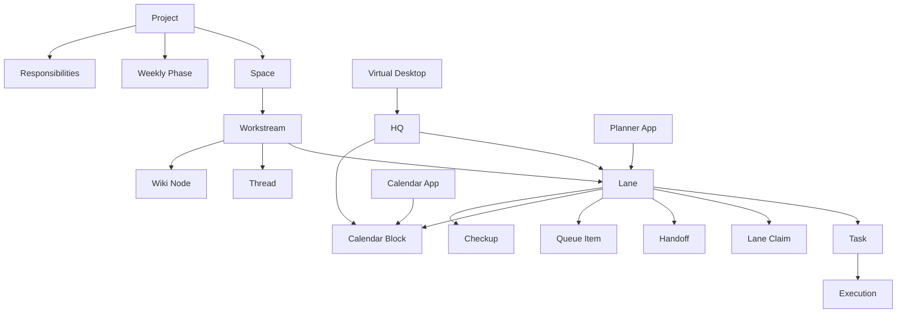

# EMA 0.0.3 Shared Agent Swarm Workspace

Related docs:
- [EMA 0.0.3 Knowledge Graph Hub](/Users/tawj/Desktop/ema 0.0.3/ema-003-knowledge-graph-hub.md)
- [EMA 0.0.3 Lineage Architecture Synthesis](/Users/tawj/Desktop/ema 0.0.3/ema-003-lineage-architecture-synthesis.md)
- [EMA 0.0.3 Gleam/BEAM Bounded Contexts](/Users/tawj/Desktop/ema 0.0.3/ema-003-gleam-beam-bounded-contexts.md)
- [EMA 0.0.3 Recovery And Implementation Plan](/Users/tawj/Desktop/ema 0.0.3/ema-003-recovery-and-implementation-plan.md)
- [EMA 0.0.3 GitHub Cross-Pollination Map](/Users/tawj/Desktop/ema 0.0.3/ema-003-github-cross-pollination-map.md)
- [Transfer Pack System Graph](</Users/tawj/Desktop/ema 0.0.3/ema-transfer-pack-20260422-060938/SYSTEM_GRAPH.md>)

Semantic anchors:
- `shared_workspace`
- `agent_swarm`
- `lane`
- `handoff`
- `queue_item`
- `planner_control_tower`
- `virtual_calendar`
- `weekly_phase`
- `checkup`
- `responsibility`
- `coordination_workspace`

## 1. Purpose

- `Confirmed`: EMA wants a shared human-agent workspace, not just better chat surfaces.
- `Confirmed`: the user wants the system to absorb agent-environment, project-management, todo/task, and self-paced virtual-calendar behavior into EMA itself.
- `Confirmed`: Proslync/Autharis swarm practice contains useful discipline around lane ownership, handoffs, shared workspace contracts, planner/control-tower upkeep, and drift prevention.
- `Inferred`: EMA should preserve those patterns as **first-class workspace objects**, not as ad hoc repo rituals.

## 2. Cross-Pollinated Inputs

### From EMA lineage

- `codebase-ema/workspace/shared/`
- `04-agent-orchestration-and-shared-workspace-briefing.md`
- `MACBOOK_AGENT_HANDOFF_MASTER.md`
- `05-fresh-context-project-app-model.md`
- `lineage-openclaw-agent-workspaces`
- `codebase-executive` and `codebase-multi-agent-expirements` as adjacent planner/productivity donors

### From Proslync/Autharis swarm routine

- explicit lane registry
- claim/hold/land lifecycle
- planner/control-tower lane
- shared workspace with handoffs and decisions log
- anti-drift coordination
- schedule/calendar/backlog separation
- folder-bound ownership discipline

## 3. EMA Adaptation Rule

- `Confirmed`: EMA should not copy the Proslync "two coordinated control planes" literally.
- `Inferred`: EMA should instead use **one canonical authority layer** plus **one shared coordination workspace**.

That means:
- `EMA authority layer` owns projects, spaces, actors, tasks, executions, approvals, artifacts, and permissions.
- `Coordination workspace` owns lanes, handoffs, planner views, queue items, schedule blocks, checkups, and responsibility tracking.
- `Hermes` still owns live execution, not planner state.

## 4. Core Thesis

- `Inferred`: the swarm is not only an execution trick. It is part of the workspace model.
- `Inferred`: the agent environment app, project management tools, todo/task environment, and virtual calendar are all one family of objects: **coordination workspace objects**.
- `Inferred`: these objects should live beside threads/wiki/files/executions as first-class EMA artifacts.

## 5. Shared Coordination Workspace Objects

### 5.1 Lane

- `lane_id`
- `project_id`
- `space_id`
- `workstream_id`
- `title`
- `scope`
- `status`
- `owner_actor_id`
- `reviewer_actor_id`
- `verifier_actor_id`
- `priority`
- `depends_on`
- `blocked_by`

`Inferred`: a lane is the unit of bounded swarm work. It may correspond to one implementation slice, one research slice, or one coordination slice.

Suggested status flow:
- `idea`
- `ready`
- `claimed`
- `in_progress`
- `review`
- `verify`
- `blocked`
- `done`
- `archived`

### 5.2 Lane Claim

- `lane_claim_id`
- `lane_id`
- `actor_id`
- `claimed_at`
- `released_at`
- `claim_reason`

`Inferred`: a lane claim makes ownership explicit and avoids invisible collisions between agents.

### 5.3 Handoff

- `handoff_id`
- `from_lane_id`
- `to_lane_id`
- `from_actor_id`
- `to_actor_id`
- `needed`
- `why`
- `blocking`
- `status`

`Confirmed`: Proslync/Autharis had the right instinct here. Cross-lane and cross-plane coordination should become explicit objects, not just chat paragraphs.

### 5.4 Queue Item

- `queue_item_id`
- `project_id`
- `space_id`
- `title`
- `kind`
- `priority`
- `source`
- `proposed_by_actor_id`
- `promoted_to_lane_id`

`Inferred`: queue items are lighter-weight than lanes. They are backlog candidates, incoming asks, reminders, and candidate actions.

### 5.5 Responsibility

- `responsibility_id`
- `actor_id`
- `project_id`
- `space_id`
- `title`
- `cadence`
- `standard_of_done`
- `active`

`Inferred`: responsibilities are durable commitments that should survive across many tasks and lanes.

### 5.6 Calendar Block

- `calendar_block_id`
- `actor_id`
- `project_id`
- `space_id`
- `lane_id`
- `task_id`
- `kind`
- `start_at`
- `end_at`
- `flex_mode`
- `energy_band`

Kinds:
- `focus`
- `checkup`
- `meeting`
- `review`
- `maintenance`
- `deep_work`
- `planning`

`Inferred`: calendar blocks should support both real wall-clock scheduling and flexible self-paced reservation.

### 5.7 Cadence Policy

- `cadence_policy_id`
- `actor_id`
- `project_id`
- `scope`
- `pattern`
- `minimum_interval`
- `target_interval`
- `checkup_style`

`Inferred`: self-paced virtual calendar behavior should be represented as cadence policy plus checkup logic, not only raw event rows.

### 5.8 Weekly Phase

- `weekly_phase_id`
- `actor_id`
- `project_id`
- `label`
- `focus_theme`
- `phase_order`
- `phase_goal`

`Confirmed`: the user explicitly wants weekly phases and self-directed scheduling inside the agent virtual environment.

### 5.9 Checkup

- `checkup_id`
- `actor_id`
- `project_id`
- `space_id`
- `lane_id`
- `task_id`
- `scheduled_for`
- `actual_at`
- `result`
- `next_action`

`Inferred`: checkups are one of the key bridges between planner state and execution state.

## 6. Coordination Workspace Rules

### 6.1 One Authority, Many Surfaces

- `Confirmed`: Threads, Chat, HQ, Planner, and Virtual Desktop must not each become their own coordinator-of-record.
- `Inferred`: they all render and mutate the same coordination objects through EMA-owned IDs.

### 6.2 Bounded Ownership

- `Inferred`: one lane should have one active owner claim at a time.
- `Inferred`: cross-project work should decompose into multiple lanes plus explicit handoffs, not one giant roaming agent task.
- `Inferred`: one run/execution may touch only one target project/space authority scope unless policy says otherwise.

### 6.3 Planner / Control Tower

- `Inferred`: planner/control-tower should be a first-class app view in the agent environment, not a hidden admin file.
- `Inferred`: it should maintain:
  - lane registry
  - backlog queue
  - blocked items
  - checkups due
  - weekly phase focus
  - workload heat

### 6.4 Drift Audits

- `Inferred`: the swarm should support explicit drift audits:
  - stale claimed lanes
  - missing handoff destinations
  - tasks with no workstream
  - executions with no lane/task relationship
  - calendar blocks that no longer match active priorities

## 7. Relationship To Existing EMA Objects

- `Project` is the hard authority boundary.
- `Space` is the main collaboration boundary.
- `Workstream` is the continuity object.
- `Task` is the durable intent object.
- `Execution` is the canonical run record.
- `Lane` is the bounded coordination wrapper around work to be done.
- `Handoff` is the explicit transfer contract.
- `QueueItem` is the backlog/front-door object.
- `CalendarBlock`, `CadencePolicy`, `WeeklyPhase`, and `Checkup` are the self-paced scheduling layer.

`Inferred`: a good default chain is:

`queue_item -> lane -> task -> execution -> outcome`

with `workstream` and `thread` spanning the whole chain.

## 8. Agent Environment App Model

The user-described "agent virtual environment app" should become an EMA app family made of these surfaces:

- `Planner`
  - lane registry
  - backlog
  - blocked work
  - handoffs
- `Calendar`
  - self-paced schedule
  - weekly phases
  - checkups
  - focus blocks
- `Responsibilities`
  - durable obligations
  - recurring standards
  - ownership
- `Queues`
  - inbox
  - backlog
  - waiting
  - delegated
- `Notes`
  - linked planner notes
  - meeting notes
  - rationale

`Inferred`: this should live as a first-class app inside HQ/Desktop, not as a detached side tool.

## 9. Suggested BEAM Context

Add `ema_coordination` as a real bounded context / OTP app.

It should own:
- `lane`
- `lane_claim`
- `handoff`
- `queue_item`
- `responsibility`
- `cadence_policy`
- `calendar_block`
- `weekly_phase`
- `checkup`

It should integrate with:
- `ema_workstreams`
- `ema_threads`
- `ema_exec_control`
- `ema_shell`

## 10. Event Streams

Recommended new stream:
- `coordination_events`

Suggested event types:
- `lane_created`
- `lane_claimed`
- `lane_released`
- `lane_blocked`
- `handoff_created`
- `handoff_accepted`
- `queue_item_promoted`
- `calendar_block_scheduled`
- `checkup_due`
- `checkup_completed`
- `weekly_phase_shifted`

## 11. First Implementation Slice

Build this before the full executive-function suite:

1. `lane`
2. `lane_claim`
3. `handoff`
4. `queue_item`
5. `calendar_block`
6. `checkup`

And wire them to:
- `project`
- `space`
- `workstream`
- `task`
- `thread`

## 12. UI / Shell Integration

### HQ

HQ should show:
- active lanes
- blocked lanes
- due checkups
- weekly phase
- queue pressure
- recent handoffs

### Virtual Desktop

Virtual Desktop should open:
- Planner board
- Calendar view
- Handoff inbox
- Thread/workstream view

### Threads / Chat

Threads and Chat should be able to:
- create queue items
- attach to a lane
- generate handoff objects
- schedule a checkup

## 13. Graph Sketch

## 14. Preserve / Adapt / Drop

### Preserve

- explicit lane ownership
- explicit handoffs
- planner/control-tower upkeep
- backlog vs schedule vs waiting separation
- drift-audit discipline
- shared workspace as a real coordination substrate

### Adapt

- multi-control-plane practice -> one EMA authority layer plus coordination workspace
- folder-bound ownership -> project/space/workstream-bound ownership
- lane registry files -> canonical EMA objects

### Drop

- hidden coordination only in repo markdown
- duplicated truth across separate admin folders
- cross-project roaming without handoff semantics

## 15. Immediate EMA 0.0.3 Changes To Treat As Canonical

1. `Inferred`: the shared workspace should include coordination objects, not only docs/files/tasks.
2. `Inferred`: the agent virtual environment is not optional UI polish; it is part of the shared workspace model.
3. `Inferred`: the self-paced virtual calendar should be modeled explicitly with cadence/checkup/weekly-phase objects.
4. `Inferred`: swarm discipline should be rendered in HQ/Desktop/Threads/Planner, not hidden in side files.
