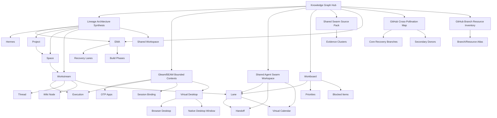

# EMA 0.0.3 Knowledge Graph Hub

This file is the current entrypoint for the local EMA 0.0.3 knowledge graph. It is not meant to be perfect taxonomy. It is meant to make the current reconstruction docs easier to traverse, cross-reference, and grow into the semantic layer EMA will eventually own.

Primary docs:
- [Deliverables Program](/Users/tawj/Desktop/ema 0.0.3/ema-003-deliverables-program.md)
- [Atlas Expansion Backlog](/Users/tawj/Desktop/ema 0.0.3/ema-003-atlas-expansion-backlog.md)
- [Implementation Slices](/Users/tawj/Desktop/ema 0.0.3/ema-003-implementation-slices.md)
- [Surface Lineage Pack](/Users/tawj/Desktop/ema 0.0.3/ema-003-surface-lineage-pack.md)
- [Lineage Architecture Synthesis](/Users/tawj/Desktop/ema 0.0.3/ema-003-lineage-architecture-synthesis.md)
- [Gleam/BEAM Bounded Contexts](/Users/tawj/Desktop/ema 0.0.3/ema-003-gleam-beam-bounded-contexts.md)
- [Shared Agent Swarm Workspace](/Users/tawj/Desktop/ema 0.0.3/ema-003-shared-agent-swarm-workspace.md)
- [Workboard](/Users/tawj/Desktop/ema 0.0.3/ema-003-workboard.md)
- [Shared Swarm Source Pack](/Users/tawj/Desktop/ema 0.0.3/ema-003-shared-swarm-source-pack.md)
- [Recovery And Implementation Plan](/Users/tawj/Desktop/ema 0.0.3/ema-003-recovery-and-implementation-plan.md)
- [GitHub Cross-Pollination Map](/Users/tawj/Desktop/ema 0.0.3/ema-003-github-cross-pollination-map.md)
- [GitHub Branch Resource Inventory](/Users/tawj/Desktop/ema 0.0.3/ema-003-github-branch-resource-inventory.md)

Primary archive links:
- [Transfer Pack Root](</Users/tawj/Desktop/ema 0.0.3/ema-transfer-pack-20260422-060938/README.md>)
- [Transfer Pack Branch Map](</Users/tawj/Desktop/ema 0.0.3/ema-transfer-pack-20260422-060938/BRANCH_MAP.md>)
- [Transfer Pack Expanded Branch Map](</Users/tawj/Desktop/ema 0.0.3/ema-transfer-pack-20260422-060938/BRANCH_MAP_EXPANDED.md>)
- [GitHub Repo](https://github.com/TrajanWJ/ema-transfer-pack-20260422-060938)

## 1. Semantic Layer Intent

- `Confirmed`: EMA should eventually own a semantic layer, not just a folder of notes.
- `Inferred`: these docs should start behaving like semantic nodes now:
  - they should link to each other
  - they should name canonical concepts consistently
  - they should expose source lineage
  - they should clarify what is authority, donor, or reference
- `Inferred`: the current hub should be treated like a seed wiki root for EMA project knowledge.

## 2. Core Concept Nodes

### Authority and Runtime

- `ema`
  - Source doc: [Lineage Architecture Synthesis](/Users/tawj/Desktop/ema 0.0.3/ema-003-lineage-architecture-synthesis.md)
  - Related: `hermes`, `execution`, `project`, `shared_workspace`
- `hermes`
  - Source doc: [Lineage Architecture Synthesis](/Users/tawj/Desktop/ema 0.0.3/ema-003-lineage-architecture-synthesis.md)
  - Related: `ema_harness`, `execution`, `session_binding`
- `execution`
  - Source doc: [Gleam/BEAM Bounded Contexts](/Users/tawj/Desktop/ema 0.0.3/ema-003-gleam-beam-bounded-contexts.md)
  - Related: `task`, `thread`, `workstream`, `hermes`
- `session_binding`
  - Source doc: [Gleam/BEAM Bounded Contexts](/Users/tawj/Desktop/ema 0.0.3/ema-003-gleam-beam-bounded-contexts.md)
  - Related: `execution`, `thread`, `provider_session`, `hermes_session`

### Project and Collaboration

- `organization`
  - Source doc: [Lineage Architecture Synthesis](/Users/tawj/Desktop/ema 0.0.3/ema-003-lineage-architecture-synthesis.md)
  - Related: `project`, `membership`, `personal_ai`
- `project`
  - Source doc: [Lineage Architecture Synthesis](/Users/tawj/Desktop/ema 0.0.3/ema-003-lineage-architecture-synthesis.md)
  - Related: `space`, `dataset`, `app_instance`, `workstream`
- `space`
  - Source doc: [Lineage Architecture Synthesis](/Users/tawj/Desktop/ema 0.0.3/ema-003-lineage-architecture-synthesis.md)
  - Related: `thread`, `wiki_node`, `replication`, `presence`
- `dataset`
  - Source doc: [Gleam/BEAM Bounded Contexts](/Users/tawj/Desktop/ema 0.0.3/ema-003-gleam-beam-bounded-contexts.md)
  - Related: `project`, `space`, `knowledge`
- `workstream`
  - Source doc: [Gleam/BEAM Bounded Contexts](/Users/tawj/Desktop/ema 0.0.3/ema-003-gleam-beam-bounded-contexts.md)
  - Related: `thread`, `wiki_node`, `task`, `execution`, `hq`
- `lane`
  - Source doc: [Shared Agent Swarm Workspace](/Users/tawj/Desktop/ema 0.0.3/ema-003-shared-agent-swarm-workspace.md)
  - Related: `workstream`, `task`, `handoff`, `queue_item`, `calendar_block`
- `handoff`
  - Source doc: [Shared Agent Swarm Workspace](/Users/tawj/Desktop/ema 0.0.3/ema-003-shared-agent-swarm-workspace.md)
  - Related: `lane`, `thread`, `task`, `planner_control_tower`
- `queue_item`
  - Source doc: [Shared Agent Swarm Workspace](/Users/tawj/Desktop/ema 0.0.3/ema-003-shared-agent-swarm-workspace.md)
  - Related: `lane`, `backlog`, `planner_control_tower`
- `weekly_phase`
  - Source doc: [Shared Agent Swarm Workspace](/Users/tawj/Desktop/ema 0.0.3/ema-003-shared-agent-swarm-workspace.md)
  - Related: `virtual_calendar`, `checkup`, `responsibility`
- `checkup`
  - Source doc: [Shared Agent Swarm Workspace](/Users/tawj/Desktop/ema 0.0.3/ema-003-shared-agent-swarm-workspace.md)
  - Related: `calendar_block`, `lane`, `task`
- `thread`
  - Source doc: [Lineage Architecture Synthesis](/Users/tawj/Desktop/ema 0.0.3/ema-003-lineage-architecture-synthesis.md)
  - Related: `chat`, `discord_bridge`, `workstream`
- `wiki_node`
  - Source doc: [Gleam/BEAM Bounded Contexts](/Users/tawj/Desktop/ema 0.0.3/ema-003-gleam-beam-bounded-contexts.md)
  - Related: `semantic_layer`, `blueprint_node`, `reference_edge`, `canvas`
- `blueprint_node`
  - Source doc: [Lineage Architecture Synthesis](/Users/tawj/Desktop/ema 0.0.3/ema-003-lineage-architecture-synthesis.md)
  - Related: `wiki_node`, `task`, `intent`, `planning`
- `shared_workspace`
  - Source doc: [Lineage Architecture Synthesis](/Users/tawj/Desktop/ema 0.0.3/ema-003-lineage-architecture-synthesis.md)
  - Related: `thread`, `wiki_node`, `file_object`, `execution`, `schedule`

### Shell and Surface

- `launchpad`
  - Source doc: [GitHub Cross-Pollination Map](/Users/tawj/Desktop/ema 0.0.3/ema-003-github-cross-pollination-map.md)
  - Related: `hq`, `virtual_desktop`, `app_registry`
- `hq`
  - Source doc: [Lineage Architecture Synthesis](/Users/tawj/Desktop/ema 0.0.3/ema-003-lineage-architecture-synthesis.md)
  - Related: `launchpad`, `workstream`, `project`, `personal_ai`
- `virtual_desktop`
  - Source doc: [Gleam/BEAM Bounded Contexts](/Users/tawj/Desktop/ema 0.0.3/ema-003-gleam-beam-bounded-contexts.md)
  - Related: `place.org`, `launchpad`, `window_state`, `shell_profile`
- `planner_control_tower`
  - Source doc: [Shared Agent Swarm Workspace](/Users/tawj/Desktop/ema 0.0.3/ema-003-shared-agent-swarm-workspace.md)
  - Related: `lane`, `handoff`, `queue_item`, `weekly_phase`, `hq`
- `chat`
  - Source doc: [Recovery And Implementation Plan](/Users/tawj/Desktop/ema 0.0.3/ema-003-recovery-and-implementation-plan.md)
  - Related: `thread`, `workstream`, `execution`, `session_binding`
- `files`
  - Source doc: [Gleam/BEAM Bounded Contexts](/Users/tawj/Desktop/ema 0.0.3/ema-003-gleam-beam-bounded-contexts.md)
  - Related: `virtual_filesystem`, `project`, `wiki_node`

## 3. Doc Graph

### Local doc links

- [Lineage Architecture Synthesis](/Users/tawj/Desktop/ema 0.0.3/ema-003-lineage-architecture-synthesis.md)
  - role: doctrine + architecture shape
  - feeds: bounded contexts, shell model, knowledge model
- [Gleam/BEAM Bounded Contexts](/Users/tawj/Desktop/ema 0.0.3/ema-003-gleam-beam-bounded-contexts.md)
  - role: implementation ontology
  - feeds: schema, OTP layout, runtime boundaries
- [Shared Agent Swarm Workspace](/Users/tawj/Desktop/ema 0.0.3/ema-003-shared-agent-swarm-workspace.md)
  - role: coordination workspace model
  - feeds: planner, lane, handoff, queue, virtual calendar
- [Workboard](/Users/tawj/Desktop/ema 0.0.3/ema-003-workboard.md)
  - role: active coordination state for this recovery wave
  - feeds: lane tracking, priorities, blocked items
- [Shared Swarm Source Pack](/Users/tawj/Desktop/ema 0.0.3/ema-003-shared-swarm-source-pack.md)
  - role: evidence consolidation
  - feeds: later canonical object docs and schema drafts
- [Recovery And Implementation Plan](/Users/tawj/Desktop/ema 0.0.3/ema-003-recovery-and-implementation-plan.md)
  - role: source-mining and build sequencing
  - feeds: recovery lanes, phase order, delivery order
- [GitHub Cross-Pollination Map](/Users/tawj/Desktop/ema 0.0.3/ema-003-github-cross-pollination-map.md)
  - role: branch-to-context mapping
  - feeds: source selection, donor discipline, pruning discipline
- [GitHub Branch Resource Inventory](/Users/tawj/Desktop/ema 0.0.3/ema-003-github-branch-resource-inventory.md)
  - role: archive atlas
  - feeds: browsing, retrieval, source lookup

### Suggested semantic relationships

## 4. Branch Graph

Core branch nodes:
- [main](https://github.com/TrajanWJ/ema-transfer-pack-20260422-060938/tree/main)
- [lineage-index](https://github.com/TrajanWJ/ema-transfer-pack-20260422-060938/tree/lineage-index)
- [design-review-fresh-context](https://github.com/TrajanWJ/ema-transfer-pack-20260422-060938/tree/design-review-fresh-context)
- [lineage-original-elixir-ema](https://github.com/TrajanWJ/ema-transfer-pack-20260422-060938/tree/lineage-original-elixir-ema)
- [codebase-ema](https://github.com/TrajanWJ/ema-transfer-pack-20260422-060938/tree/codebase-ema)
- [docs-clis-mcps-integrations](https://github.com/TrajanWJ/ema-transfer-pack-20260422-060938/tree/docs-clis-mcps-integrations)
- [codebase-claudeforge](https://github.com/TrajanWJ/ema-transfer-pack-20260422-060938/tree/codebase-claudeforge)
- [docs-host-system-launchpad-hq](https://github.com/TrajanWJ/ema-transfer-pack-20260422-060938/tree/docs-host-system-launchpad-hq)
- [codebase-place-org](https://github.com/TrajanWJ/ema-transfer-pack-20260422-060938/tree/codebase-place-org)
- [codebase-place-companion](https://github.com/TrajanWJ/ema-transfer-pack-20260422-060938/tree/codebase-place-companion)
- [lineage-openclaw-agent-workspaces](https://github.com/TrajanWJ/ema-transfer-pack-20260422-060938/tree/lineage-openclaw-agent-workspaces)
- [docs-vault-wiki](https://github.com/TrajanWJ/ema-transfer-pack-20260422-060938/tree/docs-vault-wiki)

Branch-to-context sketch:
- `lineage-original-elixir-ema` -> `ema_exec_control`, `ema_projects`, `ema_identity`
- `codebase-ema` -> `ema_exec_control`, `ema_workstreams`, `ema_harness`
- `docs-clis-mcps-integrations` -> `ema_harness`, `ema_knowledge`
- `codebase-claudeforge` -> `ema_threads`, `chat`, `discord_bridge`
- `docs-host-system-launchpad-hq` -> `ema_shell`, `launchpad`, `hq`
- `codebase-place-org` -> `virtual_desktop`, `ema_files`, browser shell
- `codebase-place-companion` -> native desktop shell, host bridge
- `lineage-openclaw-agent-workspaces` -> shared workspace doctrine, roles, scheduling
- `docs-vault-wiki` -> semantic layer, mesh notes, knowledge architecture

## 5. Suggested Next Knowledge Objects

These are worth splitting into their own docs next if you want the graph to get denser and more useful:

- `project`
- `space`
- `workstream`
- `personal_ai`
- `thread`
- `wiki_node`
- `blueprint_node`
- `execution`
- `session_binding`
- `virtual_desktop`
- `hq`
- `launchpad`
- `discord_bridge`
- `replication`

## 6. Current Knowledge-System Rules

- `Confirmed`: architecture docs should distinguish `Confirmed`, `Inferred`, and `Speculative`.
- `Confirmed`: docs should expose lineage and donor sources when possible.
- `Inferred`: a good EMA knowledge object should have:
  - a canonical concept name
  - related concepts
  - source docs
  - source branches
  - implementation impact
- `Inferred`: this local doc set should gradually move from narrative notes toward a semantic wiki shape.
