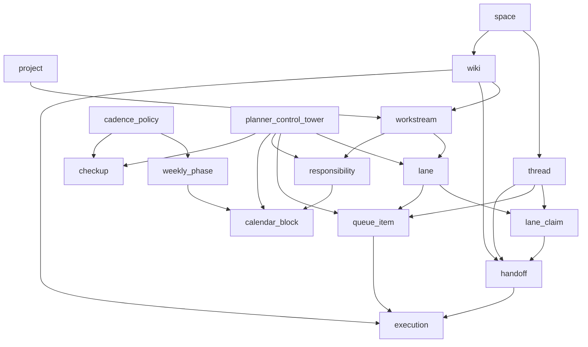

# Swarm Object Model

## Frame

This document is the canonical vocabulary for the EMA swarm workspace: the objects that coordination code, planner surfaces, and shared markdown all talk about when they say "who owns what, what is next, and what moved when."

The core rule stays in force here: **EMA owns truth. Hermes owns execution. Surfaces do not own state.** So this file describes the object model that the swarm workspace projects, not a separate source of truth living in markdown.

## Status Legend

- **Confirmed**: directly supported by the current atlas docs, briefs, graph, or swarm alignment notes.
- **Inferred**: not written as a formal schema yet, but strongly implied by the existing vocabulary and structure.
- **Speculative**: a useful working assumption that still depends on open questions, especially Project ↔ Space cardinality and the final planner/control-plane split.

## Object Graph

## Objects

| Object | Status | Canonical meaning | Key relations |
|---|---|---|---|
| `lane` | Inferred | A long-lived ownership track inside a workstream. It answers "who is currently carrying this stream of work?" | Belongs to a `workstream`; may be owned by one actor at a time; emits `lane_claim` and feeds `queue_item` / `handoff` / drift checks. |
| `lane_claim` | Inferred | An explicit claim that an actor is taking a lane. It separates "I intend to own this" from "the system recognizes ownership." | Refers to a `lane` and an actor; may promote into active ownership or be superseded by a `handoff`. |
| `handoff` | Confirmed + Inferred | A recorded transfer of responsibility from one actor to another. It is a reliability contract and a coordination event, not the execution itself. | Can reference `lane`, `queue_item`, and `execution`; may be surfaced through `thread` or `wiki`, but remains distinct from execution lineage. |
| `queue_item` | Inferred | The smallest schedulable unit in the planner queue. It is what gets ordered, routed, started, blocked, or completed. | Usually derived from a `lane`, `workstream`, or `responsibility`; may spawn an `execution`; may be resolved by `handoff`. |
| `responsibility` | Inferred | A durable assignment of ongoing duty, usually to an actor, lane, or role. It is broader than a single task and narrower than a workstream. | Belongs to a `workstream`; can generate `calendar_block`, `checkup`, and `queue_item` records. |
| `calendar_block` | Inferred | A reserved time window for a responsibility, checkup, or focus period. It is the planner's time-shaped projection of work. | Derived from `responsibility`, `weekly_phase`, or `cadence_policy`; may be anchored to a `workstream` or `space`. |
| `cadence_policy` | Speculative | The recurrence rule set that says when checkups, weekly phases, and recurring blocks should appear. | Drives `weekly_phase`, `checkup`, and recurring `calendar_block` creation. |
| `weekly_phase` | Inferred | A named weekly planning slice that groups work by phase, intent, or theme. | Usually attached to a `cadence_policy`; can collect `responsibility`, `queue_item`, and `calendar_block` objects. |
| `checkup` | Confirmed + Inferred | A scheduled maintenance or review event that asks whether the workstream is healthy, blocked, drifting, or ready to advance. | Can be produced from a `cadence_policy`; often inspects `lane`, `queue_item`, and `responsibility` state. |
| `planner_control_tower` | Speculative | The supervising planner view that reads the swarm objects, compares claims against reality, and renders coordination state without becoming the source of truth. | Projects `lane`, `queue_item`, `responsibility`, `calendar_block`, `weekly_phase`, `checkup`, and `handoff` into one operator-facing view. |
| `workstream` | Confirmed + Inferred | The primary container for ongoing effort. It is the unit that collects intent, ownership, timing, and execution lineage into one legible stream. | Sits above `lane`, `responsibility`, and `queue_item`; links outward to `thread`, `wiki`, and `execution`. |

## Relationship Rules

- `workstream` is the parent coordination object.
- `lane` is the ownership spine inside a `workstream`.
- `lane_claim` is the explicit move that says an actor is taking or continuing a lane.
- `handoff` is the explicit move that says a lane or responsibility is changing hands.
- `queue_item` is the scheduling surface for something that should happen next.
- `responsibility` is the durable duty assignment; it is broader than a queue item and survives individual dispatches.
- `calendar_block` is the time-shaped projection of work, not the work itself.
- `cadence_policy` is the recurrence rule for recurring maintenance and planning.
- `weekly_phase` is the coarse rhythm bucket that cadence policies feed.
- `checkup` is the recurring or on-demand health signal for a workstream or lane.
- `planner_control_tower` is a derived view and coordination aid; it should not own the state it renders.

## Thread, Wiki, Execution

### `thread`

**Confirmed**: threads are collaboration objects, not workspace artifacts and not control-plane records. They are live places where humans and agents talk.

**Inferred**: a thread can spawn or mirror `lane_claim`, `queue_item`, and `handoff` records, but the thread itself should not be treated as the owner of a lane.

### `wiki`

**Confirmed**: wiki nodes belong to the collaboration/semantic layer, not to raw execution.

**Inferred**: a wiki node can describe a `workstream`, record a `handoff`, or summarize `execution` outcomes.

**Speculative**: a wiki node may eventually become a first-class authority surface for a workstream, but that is still an open architecture choice.

### `execution`

**Confirmed**: execution belongs to the Hermes / control-plane side of the system and must remain explicit and replayable.

**Inferred**: a `queue_item` can dispatch an `execution`; an `execution` can validate, close, or update a `handoff`; and execution results should feed back into the `workstream`.

**Speculative**: the planner may eventually render execution inline, but the rendered surface must stay distinct from execution truth.

## Boundary Rules

- **Project boundary**: the hard execution and workspace root. Confirmed in the atlas glossary and project app model.
- **Space boundary**: the collaboration scope inside an Org. Confirmed in the atlas glossary.
- **Workstream boundary**: the coordination unit that likely needs both project context and collaboration context.
- **Thread boundary**: live collaboration inside a `space`; useful for conversation, not for canonical ownership.
- **Wiki boundary**: durable semantic context that can accompany a project or space, but should not silently absorb execution truth.

The safest current reading is:

- `project` anchors execution, sessions, and workspace roots.
- `space` anchors membership, threads, and collaboration objects.
- `workstream` bridges the two when the work needs to be both executable and collaboratively visible.

That bridge is still partly speculative because Project ↔ Space cardinality is not fully settled yet. Until that lands, the object model should carry both references explicitly instead of pretending one boundary disappears.

## Practical Canonical Reading

If two swarm artifacts disagree, prefer the object with the strongest control-plane lineage:

1. `execution` over any narrative about the run.
2. `handoff` over informal ownership claims.
3. `lane_claim` over a local recollection of who was "supposed" to be doing the work.
4. `queue_item` over a thread message that says something should happen.
5. `calendar_block` over an implied schedule.
6. `wiki` and `thread` as context, never as hidden authority.

## Basis

This model is grounded in the current atlas glossary, coordination brief, swarm alignment note, and the Gleam mapping for coordination objects. The strongest confirmed anchors are:

- `content/briefs/coordination-environment.md`
- `content/swarm/orchestrator-alignment.md`
- `INDEX.md`
- `graph.json`
- `research/parts/coordination-environment.md`

The remaining ambiguity lives in the open questions around agent identity, Project ↔ Space cardinality, harness contract shape, mirror direction, and permission mapping.
