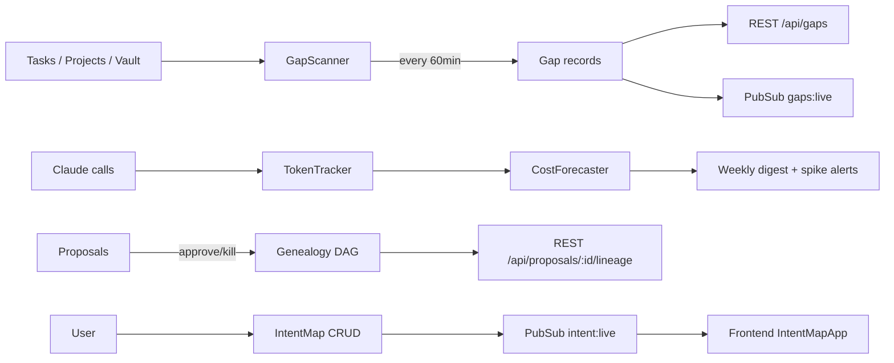
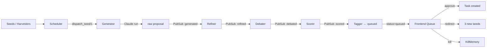
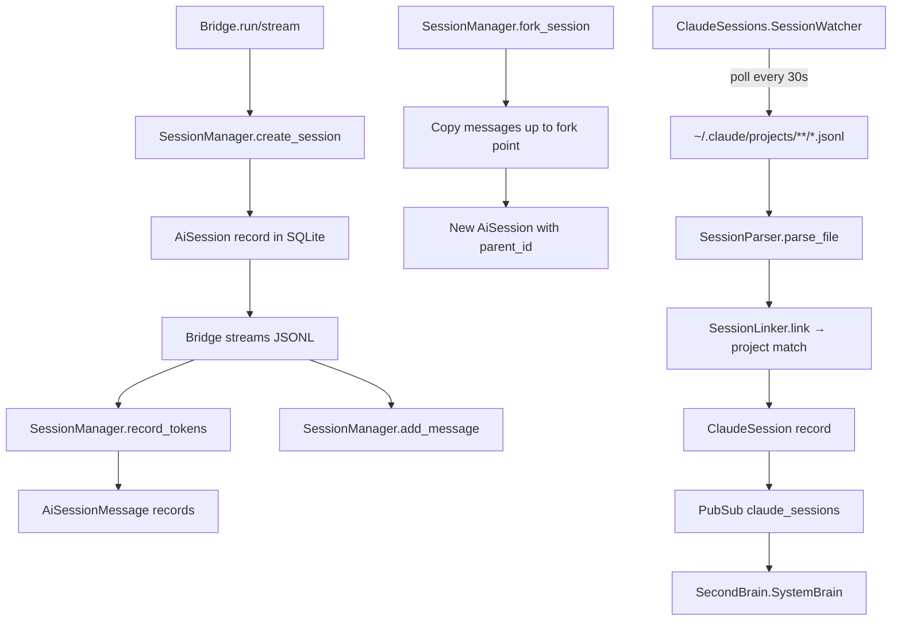
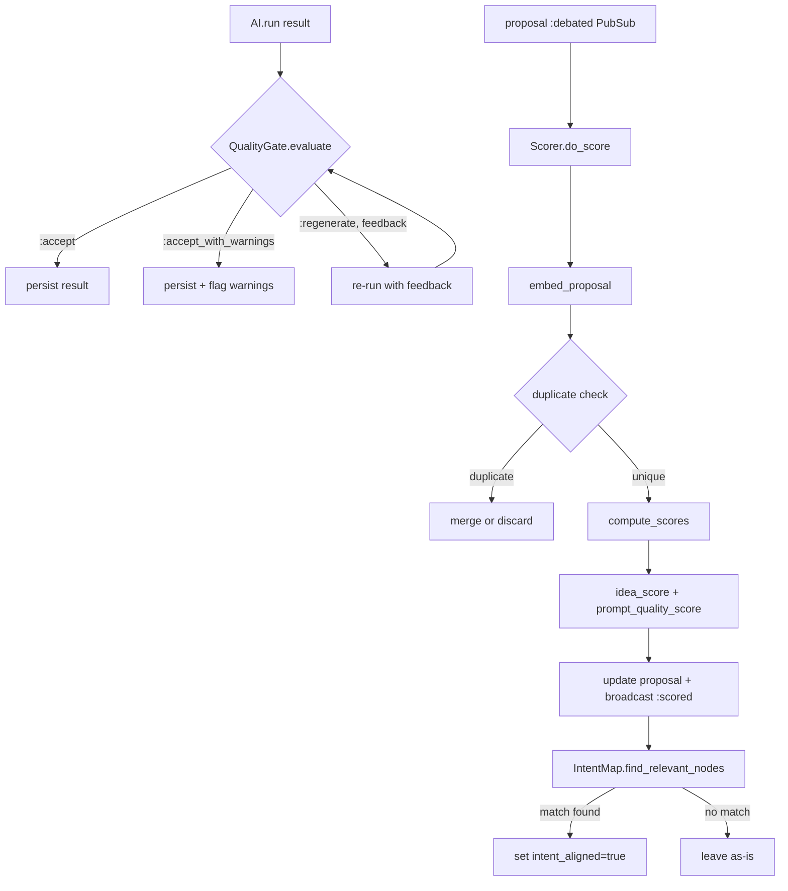
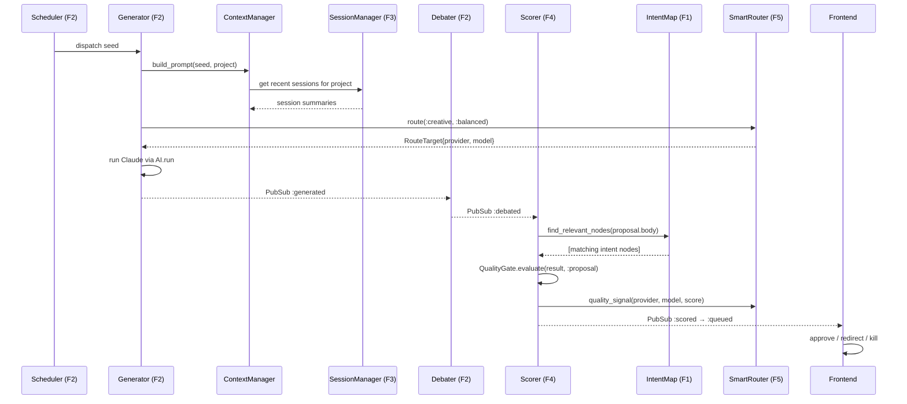
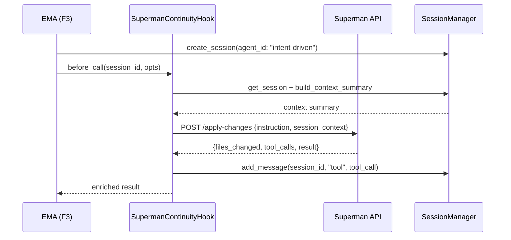

# EMA Architecture

> **Status:** As-built, April 2026  
> **Stack:** Elixir 1.18 / Phoenix 1.8 daemon · Tauri 2 · React 19 · SQLite (ecto_sqlite3)  
> **Source:** `~/Projects/ema/` on FerrissesWheel

---

## System Overview

```
┌─────────────────────────────────────────────────────────────────┐
│  Tauri 2 Shell (Rust)                                           │
│  └─ WebviewWindows: Launchpad + 13 per-app windows             │
├─────────────────────────────────────────────────────────────────┤
│  React 19 Frontend (app/src/)                                   │
│  ├─ 15 Zustand stores (REST load on mount, WS sync)            │
│  ├─ Glass morphism design system (globals.css)                  │
│  └─ Phoenix.Socket via ws.ts                                    │
├───────────────────────────────────┬─────────────────────────────┤
│  Phoenix Daemon (daemon/, :4488)  │                             │
│  ├─ REST API (/api/*)             │  SQLite                     │
│  ├─ Phoenix Channels (WS)         │  ~/.local/share/ema/ema.db  │
│  └─ OTP Supervision Trees         │                             │
├───────────────────────────────────┴─────────────────────────────┤
│  External Integrations                                          │
│  ├─ Claude CLI  (localhost subprocess via Port)                 │
│  ├─ Superman    (HTTP → localhost:3000)                         │
│  ├─ Discord     (webhook + bot via ClaudeForge)                  │
│  ├─ Ollama      (HTTP → localhost:11434)                        │
│  ├─ OpenRouter  (HTTPS API)                                     │
│  └─ Obsidian Vault (~/.local/share/ema/vault/)                 │
└─────────────────────────────────────────────────────────────────┘
```

---

## OTP Supervision Tree

```
Ema.Application
├── Ema.Repo
├── EmaWeb.Endpoint
├── Ema.PubSub                          (Phoenix.PubSub)
├── Ema.ProposalEngine.TaskSupervisor   (Task.Supervisor)
│
├── Ema.Claude.BridgeSupervisor         (DynamicSupervisor)
│   └── per-session: Ema.Claude.Bridge (GenServer + Port)
├── Ema.Claude.SessionManager           (GenServer)
├── Ema.Claude.SmartRouter              (GenServer)
├── Ema.Claude.ProviderRegistry         (GenServer)
├── Ema.Claude.AccountManager           (GenServer)
├── Ema.Claude.CircuitBreaker           (GenServer)
├── Ema.Claude.CostTracker              (GenServer)
├── Ema.Claude.Governance               (GenServer)
│
├── Ema.ProposalEngine.Supervisor       (rest_for_one)
│   ├── Ema.ProposalEngine.Scheduler
│   ├── Ema.ProposalEngine.Generator
│   ├── Ema.ProposalEngine.Refiner
│   ├── Ema.ProposalEngine.Debater
│   ├── Ema.ProposalEngine.Scorer
│   ├── Ema.ProposalEngine.Tagger
│   ├── Ema.ProposalEngine.Combiner
│   └── Ema.ProposalEngine.KillMemory
│
├── Ema.Pipes.Supervisor                (rest_for_one)
│   ├── Ema.Pipes.Registry
│   ├── Ema.Pipes.Loader
│   └── Ema.Pipes.Executor
│
├── Ema.Agents.Supervisor               (DynamicSupervisor)
│   └── per agent: AgentSupervisor
│       ├── AgentWorker
│       ├── AgentMemory
│       └── ChannelSupervisor (DynamicSupervisor)
│           ├── WebchatChannelBridge
│           ├── DiscordChannel (stub)
│           └── TelegramChannel (stub)
│
├── Ema.SecondBrain.Supervisor          (one_for_one)
│   ├── VaultWatcher
│   ├── GraphBuilder
│   └── SystemBrain
│
├── Ema.ClaudeSessions.Supervisor       (one_for_one)
│   ├── SessionWatcher
│   └── SessionMonitor
│
├── Ema.Responsibilities.Supervisor
│   ├── Scheduler
│   └── HealthCalculator
│
├── Ema.Canvas.Supervisor
│   └── DataRefresher
│
└── Ema.Intelligence.*
    ├── VmMonitor
    ├── TrustScorer
    ├── GapScanner
    ├── CostForecaster
    └── GitWatcher
```

---

## The Five Features (F1–F5)

These are the five features being actively developed in Sprint 2–5. Each has its own detailed section.

| Code | Feature | Module Root | Status |
|------|---------|-------------|--------|
| F1 | **Workflow Observatory** — Intent Map, Genealogy DAG, Gap/Friction, Budget | `Ema.Intelligence` | Partially working |
| F2 | **Proposal Intelligence** — Full pipeline, quality gates, outcome feedback | `Ema.ProposalEngine` | Pipeline wired, gaps remain |
| F3 | **Persistent Sessions** — Multi-turn Bridge sessions, fork/resume, Superman continuity | `Ema.Claude.SessionManager` + `Bridge` | Schema exists, not fully wired |
| F4 | **Quality Gradient** — QualityGate + Scorer, intent alignment, outcome learning | `Ema.Claude.QualityGate` + `ProposalEngine.Scorer` | Modules exist, loop incomplete |
| F5 | **Routing Engine** — SmartRouter consuming fitness signals and intent signals | `Ema.Claude.SmartRouter` | Routing logic exists, signals not wired |

---

## F1: Workflow Observatory

### Responsibility
Provide visibility into work: where ideas originate, how they evolve, where they stall, and what they cost. Made of 4 subsystems:

1. **IntentMap** — 5-level intent hierarchy (Product → Flow → Action → System → Implementation)  
2. **Genealogy DAG** — Proposal lineage via `parent_proposal_id` / `seed_id` edges  
3. **Friction Map (GapInbox)** — 7-source scanner for stale work, orphan notes, missing docs  
4. **Budget Awareness** — TokenTracker → CostForecaster with spike detection

### Data Flow



### Integration Points
- **F1 ↔ F2 (Genealogy Bridge):** Every `Proposal` carries `seed_id` and `parent_proposal_id`. The `Combiner` creates cross-pollination seeds from clusters, adding ancestry edges. `GET /api/proposals/:id/lineage` traverses this chain.
- **F1 ↔ F4 (Intent Alignment):** QualityGate can optionally check if a proposal body references known intent node labels. `IntentMap.find_relevant_nodes(proposal_body)` is the lookup.
- **F1 ↔ F5 (Signal Source):** GapScanner gap counts and CostForecaster signals are consumed by SmartRouter for routing weight adjustment (see F5).

---

## F2: Proposal Intelligence

### Responsibility
Autonomous, multi-stage proposal generation pipeline with debate, scoring, and user-action feedback.

### Pipeline



All stages communicate on PubSub topic `"proposals:pipeline"` with message format `{:proposals, stage_atom, proposal_struct}`.

### Integration Points
- **F2 ↔ F1 (Genealogy):** Each Generator run links `proposal.seed_id` and optionally `proposal.parent_proposal_id` when redirecting. Combiner reads existing proposals to synthesize cross-pollination seeds.
- **F2 ↔ F4 (Quality Loop):** After Debater broadcasts `:debated`, Scorer runs QualityGate checks. On `:regenerate` result, Scorer re-dispatches with feedback prompt to Generator. Max 3 iterations (hard-coded in QualityGate).
- **F2 ↔ F3 (Session Context):** ContextManager pulls `SessionStore` (recent sessions for the project) when building the Generator prompt.

---

## F3: Persistent Sessions

### Responsibility
Replace fire-and-forget Claude calls with multi-turn sessions that survive daemon restarts, support fork/resume, and feed context back into the system.

Two layers:
1. **AI Session Store** (`Ema.Claude.SessionManager`) — tracks EMA-internal sessions (cost, tokens, messages, forks)  
2. **Host Session Watcher** (`Ema.ClaudeSessions.SessionWatcher`) — passively tracks `~/.claude/projects/**/*.jsonl` on the host

### Data Flow



### Superman Continuity Hook (F3 ↔ Superman)
When EMA calls Superman's `apply_task` or `autonomous_run`, it must attach `session_context` so Superman's tool execution has continuity. The hook is:

```elixir
# daemon/lib/ema/intelligence/superman_continuity_hook.ex (to build)
defmodule Ema.Intelligence.SupermanContinuityHook do
  # Before Superman call: write current session summary to SessionStore
  def before_call(session_id, superman_opts) do
    session = SessionManager.get_session(session_id)
    context = SessionManager.build_context_summary(session)
    Map.put(superman_opts, :session_context, context)
  end

  # After Superman call: import Superman's tool_calls back as session messages
  def after_call(session_id, superman_result) do
    superman_result
    |> extract_tool_calls()
    |> Enum.each(fn tool_call ->
      SessionManager.add_message(session_id, "tool", tool_call.description, %{
        tool: tool_call.name,
        files_touched: tool_call.files
      })
    end)
  end
end
```

---

## F4: Quality Gradient

### Responsibility
Ensure AI outputs meet quality standards before being persisted. Covers:
1. **QualityGate** (`Ema.Claude.QualityGate`) — post-run checks with regenerate loop (max 3 iters)  
2. **Scorer** (`Ema.ProposalEngine.Scorer`) — 4-dimension scores: codebase coverage, architectural coherence, impact, prompt specificity  
3. **Intent alignment** — check if proposal text relates to declared intent nodes  
4. **Outcome feedback loop** — learn which proposal patterns succeed (not yet built)

### Data Flow



### Integration Points
- **F4 ↔ F1:** Scorer calls `IntentMap.find_relevant_nodes/1` to check alignment. Sets `proposal.intent_aligned` flag.
- **F4 ↔ F2:** Scorer is Stage 5 of the proposal pipeline. It directly consumes `:debated` events.
- **F4 ↔ F5:** Fitness signals from Scorer (avg `idea_score`, `prompt_quality_score` per provider) feed SmartRouter's quality tier weights.

---

## F5: Routing Engine

### Responsibility
`Ema.Claude.SmartRouter` selects the best provider + account + model for each AI task, using 6 strategies and consuming real-time fitness signals.

### Data Flow

```mermaid
flowchart TD
    A[AI.run prompt, opts] --> B[SmartRouter.route]
    B --> C{strategy?}
    C -->|:balanced| D[cost 35% + latency 35% + quality 30%]
    C -->|:cheapest| E[lowest cost_per_token]
    C -->|:fastest| F[lowest measured latency]
    C -->|:best| G[highest quality tier]
    C -->|:round_robin| H[rotate across providers]
    C -->|:failover| I[primary → fallback chain]
    
    D --> J[ProviderRegistry.healthy_providers]
    E --> J
    F --> J
    G --> J
    H --> J
    I --> J
    
    J --> K[AccountManager.best_account_for_provider]
    K --> L[RouteTarget struct]
    L --> M[Adapter.run]
    M --> N[CircuitBreaker.record_success/failure]
    N --> O[CostTracker.record]
    
    P[F4 Scorer fitness signals] --> Q[SmartRouter.update_quality_score]
    Q --> R[quality_tiers map updated in state]
    
    S[F1 GapScanner signals] --> T[SmartRouter.adjust_weights]
    T --> U[@balanced_weights updated]
```

### Signal Consumption
SmartRouter exposes two cast handlers (to build):
```elixir
# Consume fitness signal from F4
def handle_cast({:quality_signal, provider_id, model, score}, state) do
  # Update quality tier for this provider+model
  updated = Map.put(state.quality_scores, {provider_id, model}, score)
  {:noreply, %{state | quality_scores: updated}}
end

# Consume budget signal from F1 CostForecaster
def handle_cast({:budget_spike, :over_threshold}, state) do
  # Temporarily boost cost weight to 0.60
  {:noreply, %{state | balanced_weights: %{cost: 0.60, latency: 0.25, quality: 0.15}}}
end
```

---

## Cross-Feature Data Flows

### Full Proposal Lifecycle



### Session Continuity with Superman



---

## Key Design Decisions

| Decision | Rationale |
|----------|-----------|
| PubSub for proposal pipeline stages | Decouples stages — each GenServer restarts independently without breaking the chain |
| rest_for_one for ProposalEngine | If Generator dies, Refiner/Debater/Tagger stop too — no orphaned subscribers |
| SessionManager in SQLite | Sessions survive daemon restarts; memory-only state would be lost |
| SmartRouter in GenServer state | Avoids ETS; allows cast-based fitness signal updates without locking |
| QualityGate max 3 iterations | Prevents infinite regeneration loops; accepts-with-warnings on iteration 3 |
| Superman at localhost:3000 | External process; EMA doesn't manage its lifecycle. Checked via `health_check/0`. |
| AI.run/2 as unified dispatch | Single call site; `:runner` (legacy) vs `:bridge` (new) selectable via app config |

---

## Error Handling Summary

| Subsystem | Timeout | Retry | Fallback |
|-----------|---------|-------|---------|
| Claude CLI (Runner) | 120s (Task.yield) | None — caller retries | `:error` returned |
| Bridge (Port) | Configurable via GenServer.call timeout | None — new session | CircuitBreaker trips |
| Superman calls | 180s (Req receive_timeout) | None | `{:error, reason}` — caller skips |
| SmartRouter | N/A (in-process) | Failover strategy | Falls to next provider |
| CircuitBreaker soft trip | N/A | Suggest alternative | Continue if human approved |
| CircuitBreaker hard trip | N/A | Force stop | Escalate to governance |
| QualityGate | N/A | Up to 3 iterations | Accept with warnings on iter 3 |

---

## Vault Integration

EMA's `SecondBrain` uses `~/.local/share/ema/vault/` as its wiki root. Format is identical to Obsidian — standard markdown with `[[wikilinks]]`.

- **Reading:** `VaultWatcher` polls every 5s, `GraphBuilder` parses wikilinks, REST via `GET /api/vault/*`
- **Writing:** `SystemBrain` auto-writes system state files (`vault/system/state/`) with 5s debounce
- **MCP exposure:** `daemon/priv/mcp/wiki-mcp-server.js` exposes all vault operations as MCP tools for Claude Code sessions
- **Wikilink topics used by features:**
  - `[[Projects/<slug>]]` — project context nodes
  - `[[Proposals/<id>]]` — proposal record stubs  
  - `[[Decisions/<id>]]` — decision log entries
  - `[[Sessions/<date>]]` — session import summaries

---

## File Path Reference

| What | Path |
|------|------|
| Daemon entry | `daemon/lib/ema/application.ex` |
| AI dispatch (unified) | `daemon/lib/ema/claude/ai.ex` |
| Bridge GenServer | `daemon/lib/ema/claude/bridge.ex` |
| SmartRouter | `daemon/lib/ema/claude/smart_router.ex` |
| SessionManager | `daemon/lib/ema/claude/session_manager.ex` |
| QualityGate | `daemon/lib/ema/claude/quality_gate.ex` |
| CircuitBreaker | `daemon/lib/ema/claude/circuit_breaker.ex` |
| Proposal pipeline | `daemon/lib/ema/proposal_engine/` |
| Scorer | `daemon/lib/ema/proposal_engine/scorer.ex` |
| IntentMap | `daemon/lib/ema/intelligence/intent_map.ex` |
| Superman client | `daemon/lib/ema/intelligence/superman_client.ex` |
| Vault wiki | `~/.local/share/ema/vault/` |
| DB file | `~/.local/share/ema/ema.db` |
| MCP server | `daemon/priv/mcp/wiki-mcp-server.js` |
