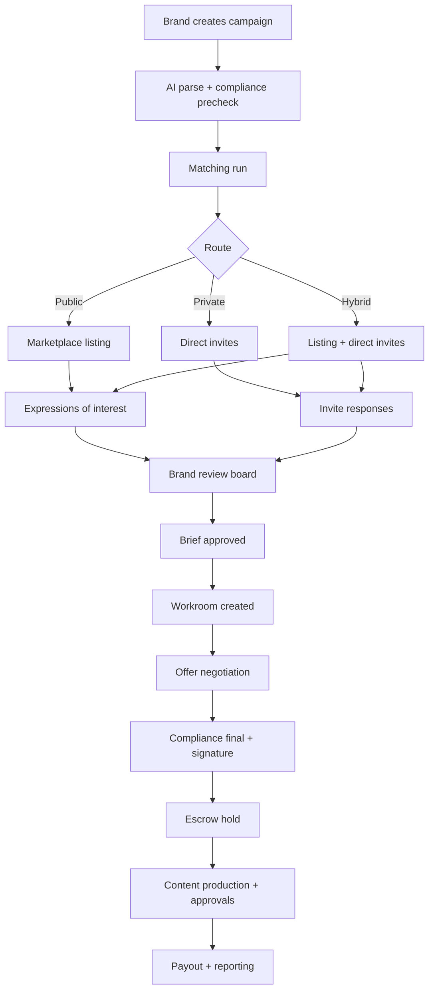

# Workflows, Popups, and Demo Logic

This document stitches the current Proslync demo into one believable operating model across matching, campaigns, chats, workrooms, offers, invites, and deal execution.

It is intended to do three things at once:

1. preserve the strongest parts of the current demo
2. make the product feel coherent across roles
3. define the next build slices in a way engineering and design can actually ship

The existing docs already cover campaign system and matching logic at a component level. This doc is the missing glue: state transitions, modal rules, route decisions, workroom behavior, and demo-grade AI/chat logic.

## Product Truth

Proslync works best when it behaves like a controlled marketplace with representation-aware routing rather than a generic creator marketplace.

That means:

- matching is explainable, not magical
- compliance is visible, not hidden
- invites and offers are distinct moments
- chats are contextual, not free-floating DMs
- every serious opportunity ends in a workroom
- represented athletes and agents stay first-class throughout the flow
- `Dev Login` remains available so the demo can switch roles instantly

## Core Objects

### Campaign
A brand-defined opportunity with targeting, deliverables, budget, visibility, and compliance posture.

### Match Candidate
A scored athlete-or-agent route recommendation for a campaign.

### Invite
A permissioned opportunity opening. Invites can be direct-to-athlete, agent-routed, or dual-routed.

### Expression of Interest
Inbound interest on public or hybrid campaigns. This is not yet a deal and should not skip compliance review.

### Brief
The structured outreach packet that explains scope, deliverables, timing, and brand context.

### Workroom
The deal execution space created after mutual interest is real. This is where negotiation, files, approvals, milestones, and final delivery live.

### Offer
The commercial proposal inside a workroom. Offers are versioned and can be accepted, declined, or countered.

### Deal
The legally meaningful object that moves through signature, escrow, execution, approval, and payout.

## North-Star Workflow

## Campaign Modes And Routing Logic

The current campaign types are correct and should be preserved.

### 1. Public Marketplace
Use when the brand wants reach and discovery.

Rules:

- visible only to eligible athletes or agents
- allows inbound expressions of interest
- brand can still privately promote top candidates from the public pool into workrooms
- best for sourcing breadth, not stealth

### 2. Private Invite
Use when the brand knows the talent pool or needs confidentiality.

Rules:

- not shown in public feeds
- invite required for visibility
- can be athlete-direct, agent-first, or dual-routed
- ideal for renewals, exclusives, sensitive launches, and premium budgets

### 3. Hybrid Shortlist
Use when the brand wants signal from the market plus control.

Rules:

- public feed is constrained by hard filters
- top candidates also get direct invites
- inbound and invited candidates appear together in a review board
- should be the recommended default for many demo scenarios

### 4. Agent-Routed
Use when representation should mediate first contact.

Rules:

- athlete may not see the opportunity until the agent opens it
- negotiations start with agent as primary negotiator
- direct athlete visibility can be enabled later by policy or manual brand choice

## Matching Engine Decision Model

The current matching engine is a strong seed but needs a more product-facing output contract.

Every candidate should be returned in one of three buckets:

- `top_matches`
- `needs_review`
- `blocked`

Every candidate should carry:

- `score`
- `confidence`
- `routeRecommendation`
- `visibilityRecommendation`
- `topReasons[]`
- `riskFlags[]`
- `requiredDisclosures[]`
- `representationMode`
- `nextBestAction`

### Hard Filters
These never rely on fuzzy AI output.

- school restriction blocks category or specific deliverable
- state rule mismatch
- athlete age or enrollment gap where required
- athlete on hold due to compliance review
- exclusivity conflict with active deal
- budget below plausible floor
- prohibited product class

### Soft Scoring
These drive ranking only after hard filters pass.

- audience fit
- engagement quality
- sport-category relevance
- delivery reliability
- geography fit
- campaign timing fit
- content format history
- conversion potential
- brand safety confidence

### Route Recommendation Logic

| Condition | Recommended route |
| --- | --- |
| represented athlete + premium or negotiated campaign | `agent_routed` |
| high score + low risk + scalable brief | `private_invite` or `hybrid_priority` |
| medium score + broad sourcing objective | `public_feed` |
| strong fit but disclosure uncertainty | `needs_review` |
| hard rule failure | `blocked` |

### Explainability Contract
Never show only a score.

Every match explanation should answer:

- why this athlete fits
- why this athlete is safe or risky
- whether the athlete should see it directly
- whether the agent should be contacted first
- what could still block the deal

## Unified Lifecycle State Machines

## Campaign State Machine

Recommended canonical campaign statuses:

- `draft`
- `enriching`
- `precheck_failed`
- `ready_to_launch`
- `live_public`
- `live_private`
- `live_hybrid`
- `paused`
- `filled`
- `archived`

Transitions:

- `draft -> enriching`
- `enriching -> precheck_failed | ready_to_launch`
- `ready_to_launch -> live_public | live_private | live_hybrid`
- `live_* -> paused | filled | archived`
- `paused -> live_public | live_private | live_hybrid | archived`

### Invite State Machine

- `draft`
- `scheduled`
- `sent`
- `viewed`
- `interested`
- `declined`
- `expired`
- `revoked`
- `converted_to_workroom`

Rules:

- an invite can be viewed without commitment
- `interested` is not a signed deal
- only one active conversion path per invite
- revocation is allowed until a workroom exists

### Workroom State Machine

- `pending_open`
- `active`
- `awaiting_brand`
- `awaiting_athlete`
- `awaiting_agent`
- `awaiting_compliance`
- `offer_sent`
- `counter_pending`
- `ready_for_signature`
- `signed`
- `in_delivery`
- `approval_pending`
- `paid`
- `closed`
- `stalled`

Interpretation:

- workroom state is the operational state
- deal state is the legal-commercial state
- they move together but should not be collapsed into one field

### Offer State Machine

- `draft`
- `sent`
- `viewed`
- `countered`
- `accepted`
- `declined`
- `expired`
- `withdrawn`

Offer rules:

- offers are versioned
- only one latest active version exists
- counters create a new version and preserve prior history
- accepting an offer moves the workroom toward signature, not directly to payout

### Deal State Machine

The current deal stages are a good demo seed but should be expanded to reflect the real lifecycle:

- `draft`
- `offered`
- `in_review`
- `accepted_terms`
- `compliance_final_review`
- `signature_pending`
- `executed`
- `escrow_funded`
- `in_progress`
- `submitted`
- `revision_requested`
- `approved`
- `payout_pending`
- `completed`
- `disputed`
- `cancelled`

For the demo UI, the simpler current pipeline can still render as:

- Draft
- Brief Sent
- Athlete Reviewing
- Negotiating
- Contract Signed
- In Progress
- Completed

But internally the richer state model gives the app believable edge cases.

## Chat And Workroom Rules

The product should have two kinds of communication surfaces.

### 1. Campaign Thread
Lightweight pre-deal messaging tied to a campaign or invite.

Use for:

- clarifying campaign fit
- answering basic timing or deliverable questions
- expressing interest
- routing to agent

Not for:

- final negotiated commercial terms
- file approval
- milestone signoff
- payout management

### 2. Deal Workroom Chat
Structured execution space once both sides want to move forward.

Use for:

- negotiation
- offer version discussion
- contract coordination
- deliverable alignment
- submission links
- revision notes
- approval and payout updates

### Workroom Tabs
Recommended first-pass tabs:

- `Chat`
- `Offer`
- `Scope`
- `Files`
- `Milestones`
- `Compliance`
- `Timeline`

This can ship as one page with tabbed panes.

### Participant Visibility Rules

| Scenario | Brand | Athlete | Agent |
| --- | --- | --- | --- |
| public campaign discovery | yes | yes | optional |
| private invite, athlete direct | yes | yes | optional after join |
| private invite, agent routed | yes | hidden or read-only until opened | yes |
| represented athlete workroom | yes | yes or partial | yes |
| negotiation-only agent phase | yes | optional summary only | yes |

Important rule:

- if an athlete is represented and the route is `agent_routed`, the app should default to agent-first messaging and show the athlete a passive status like `Your representation is reviewing this opportunity` rather than dropping them into a negotiation thread immediately

## Modal And Popup Inventory

These are the strongest new UI moments to make the product feel alive.

## Brand Side

### Campaign Launch Recommendation Modal
Triggered after AI parse and precheck.

Shows:

- suggested campaign mode
- estimated candidate counts
- risk flags
- recommended route mix
- CTA: `Launch Public`, `Send Private Invites`, `Use Hybrid`, `Edit Campaign`

Why it matters:
This turns matching and compliance into a decision moment instead of hidden backend work.

### Candidate Explanation Drawer
Triggered from a match card.

Shows:

- score breakdown
- fit reasons
- risk flags
- representation note
- route recommendation
- invite suggestion copy

### Send Invite Modal
Fields:

- recipient route: athlete / agent / both
- expiration date
- message tone preset
- compensation visibility toggle
- stealth notes
- attach brief yes/no

### Launch Guardrail Modal
Shown when brand attempts to launch with unresolved issues.

Possible variants:

- budget too low for selected segment
- school or state conflict
- prohibited category warning
- missing disclosure requirements
- missing deliverable details

### Create Workroom Confirmation Modal
Shown when converting invite or inbound interest into a real deal room.

Copy should clarify:

- participants who will be added
- whether pricing is visible
- whether the first offer is included
- whether the athlete is invited now or after agent review

## Athlete Side

### Why You’re Seeing This Modal
Shown when an athlete opens a campaign from a private or hybrid route.

Shows:

- why they matched
- whether their agent was also notified
- what the brand is asking for
- whether any disclosure or category concerns exist

### Interested / Pass Modal
Simple but crucial.

Actions:

- `I’m interested`
- `Pass`
- `Ask a question`
- `Route to my agent`

### Contract Coach Drawer
Keep and strengthen this existing AI surface.

Add:

- plain-language term explanation
- red-flag summary
- disclosure reminders
- suggested questions to ask before signing

### Submission Confirmation Modal
Shown before final content or link submission.

Shows:

- which milestone is being completed
- what files/links are attached
- whether rights usage is acknowledged
- note to brand

## Agent Side

### Representation Review Modal
First-stop popup for agent-routed invites.

Shows:

- athlete name
- why the campaign fits
- compliance notes
- exclusivity warnings
- estimated budget posture
- CTA: `Open Negotiation`, `Pass`, `Request More Info`, `Share With Athlete`

### Conflict Alert Modal
Triggered when athlete has overlapping category exclusivity or timing collision.

Shows:

- conflicting active or pending deals
- contract windows
- risk severity
- CTA: `Escalate`, `Proceed with caution`, `Decline`

### Counteroffer Builder Modal
Fields:

- total fee
- deliverable changes
- usage rights changes
- exclusivity window changes
- turnaround date changes
- notes to brand

## Shared System Popups

### Compliance Hold Modal
Use when a user tries to proceed but a rule is unresolved.

States:

- `needs_disclosure`
- `manual_review_required`
- `blocked`

### Escrow Status Modal
Simple but persuasive demo moment.

Shows:

- funding pending / funded / releasing
- milestone amount
- payout timing
- payment events timeline

### Deal Stall Nudge Modal
If a workroom goes cold.

Prompt examples:

- `Waiting on brand feedback for 3 days`
- `Athlete has not reviewed counteroffer`
- `Compliance review still missing school disclosure form`

## Sample Demo Chat Logic

The chat should feel helpful and specific, not like random lorem ipsum. These are not LLM-only outputs; they can be seeded templates keyed off campaign type, status, and participant role.

## Brand -> Athlete First Message

### Private invite, athlete direct
> Hi Maya — we’re launching a 4-week recovery campaign around training-day routines and your track content stood out because your audience engagement is strong and the tone is a clean fit for the brand. If this looks interesting, we can share the brief and proposed timing here.

### Hybrid campaign follow-up
> Thanks for raising your hand. You’re one of the strongest fits from the current shortlist because your audience and recent content line up with the campaign’s target demographic. If you’re open, we’d like to move this into a workroom and share a first offer.

## Athlete -> Brand

### Interested
> I’m interested. Timing looks workable from my side, but I’d want to confirm usage rights and whether one of the deliverables can be a reel instead of a static post.

### Route to agent
> This looks promising. Please route the commercial details through my representation and keep me posted on the creative scope.

## Agent -> Brand

### Request more info
> We’re open to exploring this, but before we move forward I need clarification on exclusivity, paid usage duration, and the approval turnaround expected after submission.

### Counter posture
> We like the fit and the timeline is workable. To move ahead, we’d need to revise the package to two short-form videos, one story sequence, 60-day paid usage, and a fee of $8,500.

## Brand -> Agent in workroom
> That structure is close. We can do the two videos and story sequence, but we’d want 30-day paid usage at the current budget or 60-day usage with a modest fee increase. If that works, I’ll update the offer version now.

## System Assistant Inline Summaries

These should be deterministic or lightly templated.

Examples:

- `System: Match confidence is high because audience fit, track-category relevance, and engagement quality all cleared threshold.`
- `System: Invite was routed to representation first because this athlete is marked as represented for premium-brand negotiations.`
- `System: Compliance review requires disclosure language before signature can proceed.`
- `System: Escrow funding confirmed. Delivery can begin.`

## Believable Demo Logic

The demo does not need full production AI to feel real. It needs consistent branching.

### Demo Rule Set

1. every campaign gets a recommended mode
2. every candidate gets a route recommendation
3. represented athletes default to agent-routed on higher-budget campaigns
4. compliance can block, hold, or clear actions
5. only mutual interest creates a workroom
6. only accepted offer terms unlock signature
7. escrow funding happens before content delivery starts
8. submission can lead to approval or revision request

### Useful Demo Heuristics

- if `quarterlyBudget` or campaign budget is high and athlete is represented: prefer `agent_routed`
- if score >= 85 and no hard flags: show `top_match`
- if score 70-84 with one mild compliance issue: show `needs_review`
- if prohibited category or active exclusivity: show `blocked`
- if invite not opened after 5 demo days: suggest resend or alternate route
- if workroom silent after offer: show stall nudge

### Demo Data Seeds That Would Help

- at least 2 represented athletes
- at least 1 exclusivity conflict scenario
- at least 1 compliance-hold scenario needing disclosure
- at least 1 hybrid campaign with both inbound and invited candidates
- at least 1 deal in revision cycle after submission
- at least 1 escrow-funded active deal

## Recommended Screen Additions

These are the strongest surfaces to add next without overbuilding.

### 1. Brand Campaign Launch Decision Screen
A decision-oriented handoff from campaign builder into matching/compliance.

Needs:

- campaign summary
- AI recommendation card
- candidate estimate buckets
- compliance status
- launch CTA group

### 2. Candidate Review Board
A kanban or bucketed list for `top_matches`, `needs_review`, `blocked`.

Needs:

- score chips
- route badges
- explanation drawer
- quick invite action
- compare action

### 3. Invite Manager
A single list of sent invites, views, responses, expiration, and workroom conversions.

Needs:

- status filters
- resend / revoke
- route type badges
- open thread button

### 4. Deal Workroom
Most important missing product slice.

Needs:

- threaded chat
- offer panel
- milestones
- files
- compliance timeline
- escrow status

### 5. Agent Opportunity Desk
A representation-first inbox for invites, conflicts, and counters.

Needs:

- new opportunities
- waiting on brand
- waiting on athlete
- conflict alerts
- counter builder

## Best Next Build Slices

These should be the next slices because they compound and make the demo feel dramatically more complete.

## Slice 1: Matching Output Contract + Candidate Review Board
Why first:

- it upgrades the current scoring into a usable product surface
- it gives the brand side a reasoned decision layer
- it provides immediate value without requiring full negotiation flows

Ship:

- bucketed candidate results
- explanation drawer
- route recommendation badge
- quick invite modal

## Slice 2: Invite Manager + Invite State Machine
Why second:

- it turns campaigns into trackable outreach instead of one-off actions
- it creates believable conversion logic between campaign and workroom

Ship:

- invite statuses
- expiration / resend / revoke
- route type support
- interested / pass / ask-question actions

## Slice 3: Workroom Shell
Why third:

- this is where the product stops feeling like a static marketplace and starts feeling operational
- it connects chat, offers, compliance, and milestones in one place

Ship:

- chat tab
- offer tab
- timeline tab
- participant chips
- state ribbon

## Slice 4: Offer Versioning + Counter Builder
Why fourth:

- gives agent workflows teeth
- makes negotiations feel real
- creates the bridge into signature and escrow

Ship:

- offer versions
- accept / decline / counter
- system timeline events
- recommended next action

## Slice 5: Compliance Hold + Escrow Timeline UX
Why fifth:

- makes trust visible
- increases realism with controlled operational states

Ship:

- compliance hold modal
- disclosure checklist
- escrow funded badge
- payout pending timeline step

## Dev Login Preservation Rule

`Dev Login` is a feature, not a hack.

Preserve it as the demo control plane.

It should continue to:

- switch roles instantly
- deep-link to key demo surfaces
- seed realistic role states
- allow testing represented vs non-represented personas
- expose scenario presets later

Recommended enhancement:

Add a `Demo Scenario` switcher inside Dev Login for:

- `Private invite / athlete direct`
- `Agent-routed premium deal`
- `Hybrid campaign with inbound interest`
- `Compliance hold before signature`
- `Submitted content needs revision`

## Implementation Notes For Current Codebase

The current repo already has enough building blocks to start this without a huge rewrite:

- matching engine exists and can be upgraded to bucketed output
- deals store exists and can evolve into richer workroom states
- pipeline metadata exists and can keep the simplified stage ribbon
- compliance engine already gives a place to branch hold vs blocked
- Dev Toolbar already preserves instant role switching and should stay visible during feature buildout

Recommended architecture move:

- keep demo UI stages simple
- add richer internal status enums in stores and seed data
- use deterministic template generation for chat copy and recommendations before introducing heavier AI dependencies

## Final Product Principle

Proslync should feel like:

- a smart sourcing and dealmaking platform
- with visible compliance intelligence
- and representation-aware routing
- where every serious opportunity graduates into a workroom

That is the cleanest path to a believable demo now and a real product later.
