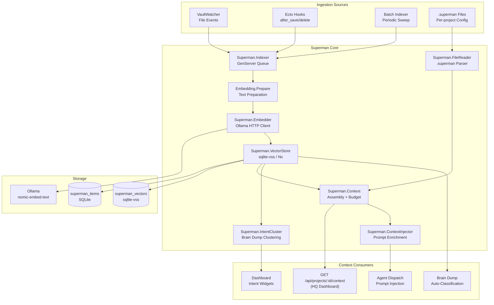

# Superman Architecture — Semantic Intelligence Layer for EMA

> **Version:** 1.0  
> **Date:** 2026-04-03  
> **Status:** Design Complete — Ready for MVP Implementation  
> **Author:** Superman Architect  

---

## Executive Summary

Superman is not an app — it's infrastructure. It's the semantic intelligence layer that makes every EMA module context-aware. It indexes vault content, projects, tasks, proposals, brain dump items, and executions into a queryable embedding space. It detects intent clusters in brain dumps. It injects relevant context into agent prompts. It powers the `GET /api/projects/:id/context` endpoint that makes HQ real.

**Core thesis:** Every item in EMA has a semantic fingerprint. Superman computes, stores, and queries those fingerprints to answer one question: *"What's relevant right now?"*

---

## Table of Contents

1. [Embedding Architecture](#1-embedding-architecture)
2. [Vector Storage](#2-vector-storage)
3. [Indexing Pipeline](#3-indexing-pipeline)
4. [Context Injection Points](#4-context-injection-points)
5. [Intent Modeling](#5-intent-modeling)
6. [MVP Embedding Pipeline (1-Sprint)](#6-mvp-embedding-pipeline-1-sprint)
7. [Scaling Roadmap](#7-scaling-roadmap)

---

## 1. Embedding Architecture

### Model Choice: `nomic-embed-text` via Ollama (local)

| Model | Dims | Speed (local) | Quality | Cost | Offline |
|-------|------|---------------|---------|------|---------|
| OpenAI `text-embedding-3-small` | 1536 | ~100ms/item (API) | Excellent | $0.02/1M tokens | ❌ |
| OpenAI `text-embedding-3-large` | 3072 | ~150ms/item (API) | Best-in-class | $0.13/1M tokens | ❌ |
| `nomic-embed-text` (Ollama) | 768 | ~50ms/item (local) | Very good | Free | ✅ |
| `mxbai-embed-large` (Ollama) | 1024 | ~80ms/item (local) | Excellent | Free | ✅ |
| Mistral `mistral-embed` | 1024 | ~120ms/item (API) | Good | $0.1/1M tokens | ❌ |

**Decision: `nomic-embed-text` via local Ollama for MVP. `mxbai-embed-large` as upgrade path.**

**Rationale:**
- **EMA is local-first.** Sending vault contents to OpenAI violates the core design principle. Everything stays on-machine.
- **768 dimensions is plenty** for EMA's scale (hundreds to low thousands of items). Diminishing returns beyond that for personal knowledge bases.
- **50ms/item** means re-indexing 1,000 items takes ~50 seconds — acceptable for background batch processing.
- **Zero cost, zero dependency** — no API keys, no rate limits, no network dependency.
- **Ollama is already the standard** for local model serving in this ecosystem. One `ollama pull nomic-embed-text` and done.

**Fallback strategy:** If Ollama isn't available (fresh install, resource-constrained machine), fall back to Bumblebee with `all-MiniLM-L6-v2` (384 dims, runs in pure Elixir/Nx). Slower but zero external dependency.

### Batch vs Real-Time Strategy

```
                 ┌─────────────────────────┐
                 │   Embedding Strategy     │
                 └────────┬────────────────┘
                          │
              ┌───────────┴───────────┐
              │                       │
    ┌─────────▼────────┐   ┌─────────▼────────┐
    │  Real-Time Path  │   │   Batch Path     │
    │  (< 5 items)     │   │   (≥ 5 items)    │
    └─────────┬────────┘   └─────────┬────────┘
              │                       │
    Immediate embed on     Queued → GenServer  
    VaultWatcher event     processes in chunks  
    or DB insert           of 50, throttled     
              │                       │
              └───────────┬───────────┘
                          │
                  Store in sqlite-vss
```

**Real-time path:** Single-item embeds triggered by VaultWatcher file events or Ecto changesets. Target: <100ms per item. Used for: new brain dump items, task updates, vault note edits.

**Batch path:** Bulk operations queued through a GenServer. Used for: initial full-vault index, periodic refresh, project import. Processes chunks of 50, with 100ms delay between chunks to avoid CPU spikes.

### Embedding Input Preparation

Not everything gets embedded raw. Each entity type has a **text preparation function** that constructs the optimal embedding input:

```elixir
defmodule Superman.Embedding.Prepare do
  @doc "Construct embeddable text from an entity"
  
  def prepare(:vault_note, note) do
    """
    Title: #{note.title}
    Tags: #{Enum.join(note.tags, ", ")}
    Path: #{note.path}
    Content: #{truncate(note.content, 2000)}
    """
  end
  
  def prepare(:task, task) do
    """
    Task: #{task.title}
    Status: #{task.status}
    Project: #{task.project_name}
    Description: #{task.description || ""}
    Tags: #{Enum.join(task.tags || [], ", ")}
    """
  end
  
  def prepare(:proposal, proposal) do
    """
    Proposal: #{proposal.title}
    Status: #{proposal.status}
    Problem: #{proposal.problem_statement || ""}
    Solution: #{truncate(proposal.solution || "", 1000)}
    Tags: #{Enum.join(proposal.tags || [], ", ")}
    """
  end
  
  def prepare(:brain_dump, item) do
    """
    Brain Dump: #{item.content}
    Category: #{item.category || "uncategorized"}
    Created: #{item.inserted_at}
    """
  end
  
  def prepare(:project, project) do
    """
    Project: #{project.name}
    Status: #{project.status}
    Description: #{project.description || ""}
    Path: #{project.path || ""}
    Tags: #{Enum.join(project.tags || [], ", ")}
    """
  end
  
  def prepare(:execution, execution) do
    """
    Execution: #{execution.title || "Untitled"}
    Status: #{execution.status}
    Project: #{execution.project_name}
    Result: #{truncate(execution.result || "", 500)}
    """
  end
  
  defp truncate(text, max) when byte_size(text) > max do
    String.slice(text, 0, max) <> "..."
  end
  defp truncate(text, _max), do: text
end
```

---

## 2. Vector Storage

### Decision: sqlite-vss (SQLite extension)

| Storage | Pros | Cons | Verdict |
|---------|------|------|---------|
| **sqlite-vss** | Same DB as EMA (SQLite), zero new infra, file-based, embedded | Max ~100K vectors efficiently, limited ANN algorithms | ✅ **MVP + Phase 2** |
| **pgvector** | Production-grade, great scaling, SQL interface | Requires Postgres — EMA uses SQLite, adds operational complexity | ❌ Overkill, wrong DB |
| **Qdrant** | Purpose-built, excellent at scale, rich filtering | External service, Docker dependency, operational overhead | ❌ Phase 4 maybe |
| **Chroma** | Python-native, easy API | Python dependency in Elixir app, limited filtering | ❌ Wrong ecosystem |

**Rationale:**
- EMA is SQLite-native (`ecto_sqlite3`). Adding a second database engine for vectors is unnecessary complexity at this scale.
- sqlite-vss handles up to ~100K vectors comfortably. EMA will have hundreds to low thousands of items for years.
- Single file, zero ops, backups are just file copies, works offline.
- If EMA ever outgrows sqlite-vss (100K+ vectors with sub-10ms query requirements), migrate to Qdrant. But that's a Phase 4 problem.

### Schema Design

```sql
-- Core vector table (sqlite-vss virtual table)
CREATE VIRTUAL TABLE superman_vectors USING vss0(
  embedding(768)  -- nomic-embed-text dimension
);

-- Metadata table (regular SQLite, joined by rowid)
CREATE TABLE superman_items (
  id INTEGER PRIMARY KEY,
  entity_type TEXT NOT NULL,      -- 'vault_note', 'task', 'proposal', 'brain_dump', 'project', 'execution'
  entity_id TEXT NOT NULL,        -- UUID or path (vault notes use path, DB entities use UUID)
  project_id TEXT,                -- nullable, for project-scoped queries
  title TEXT,                     -- display title
  content_hash TEXT NOT NULL,     -- SHA256 of prepared text (for staleness detection)
  embedded_at TEXT NOT NULL,      -- ISO8601 timestamp
  source TEXT NOT NULL,           -- 'vault_watcher', 'ecto_hook', 'batch_index', 'manual'
  metadata TEXT,                  -- JSON blob for entity-specific metadata
  status TEXT DEFAULT 'active',   -- 'active', 'stale', 'deleted'
  
  UNIQUE(entity_type, entity_id)
);

CREATE INDEX idx_superman_items_entity ON superman_items(entity_type, entity_id);
CREATE INDEX idx_superman_items_project ON superman_items(project_id);
CREATE INDEX idx_superman_items_type ON superman_items(entity_type);
CREATE INDEX idx_superman_items_status ON superman_items(status);
```

### Query Pattern

```sql
-- Find top 10 items semantically similar to a query embedding
SELECT 
  si.entity_type,
  si.entity_id, 
  si.title,
  si.project_id,
  si.metadata,
  sv.distance
FROM superman_vectors sv
JOIN superman_items si ON si.id = sv.rowid
WHERE si.status = 'active'
  AND si.project_id = ?  -- optional: scope to project
ORDER BY sv.distance ASC
LIMIT 10;
```

### Ecto Integration

```elixir
defmodule Superman.VectorStore do
  @moduledoc "Interface to sqlite-vss vector storage"
  
  alias Ema.Repo
  
  @doc "Store an embedding for an entity"
  def upsert(entity_type, entity_id, embedding, metadata \\ %{}) do
    content_hash = metadata[:content_hash] || ""
    title = metadata[:title] || ""
    project_id = metadata[:project_id]
    
    # Upsert metadata row
    Repo.query!("""
      INSERT INTO superman_items (entity_type, entity_id, project_id, title, content_hash, embedded_at, source, metadata, status)
      VALUES (?1, ?2, ?3, ?4, ?5, ?6, ?7, ?8, 'active')
      ON CONFLICT(entity_type, entity_id) DO UPDATE SET
        content_hash = ?5, embedded_at = ?6, metadata = ?8, status = 'active'
      RETURNING id
    """, [entity_type, entity_id, project_id, title, content_hash, 
          DateTime.utc_now() |> DateTime.to_iso8601(),
          metadata[:source] || "unknown",
          Jason.encode!(metadata)])
    |> then(fn %{rows: [[id]]} ->
      # Upsert vector (sqlite-vss uses rowid matching)
      Repo.query!("INSERT OR REPLACE INTO superman_vectors(rowid, embedding) VALUES (?1, ?2)", 
        [id, serialize_embedding(embedding)])
      {:ok, id}
    end)
  end
  
  @doc "Query for similar items"
  def search(query_embedding, opts \\ []) do
    limit = Keyword.get(opts, :limit, 10)
    project_id = Keyword.get(opts, :project_id)
    entity_types = Keyword.get(opts, :entity_types)
    
    {where_clauses, params} = build_filters(project_id, entity_types)
    
    Repo.query!("""
      SELECT si.entity_type, si.entity_id, si.title, si.project_id, 
             si.metadata, sv.distance
      FROM superman_vectors sv
      JOIN superman_items si ON si.id = sv.rowid
      WHERE si.status = 'active' #{where_clauses}
      AND vss_search(sv.embedding, ?1)
      ORDER BY sv.distance ASC
      LIMIT ?2
    """, [serialize_embedding(query_embedding), limit | params])
    |> format_results()
  end
  
  @doc "Mark an entity's embedding as stale (needs re-embed)"
  def mark_stale(entity_type, entity_id) do
    Repo.query!("UPDATE superman_items SET status = 'stale' WHERE entity_type = ?1 AND entity_id = ?2",
      [entity_type, entity_id])
  end
  
  defp serialize_embedding(embedding) when is_list(embedding) do
    # sqlite-vss expects JSON array of floats
    Jason.encode!(embedding)
  end
end
```

---

## 3. Indexing Pipeline

### What Gets Indexed (Priority Order)

```
Priority 1 (MVP — Week 1):
├── Vault notes (.md files in watched vault)
├── Projects (Ecto schema)
└── Tasks (Ecto schema)

Priority 2 (Sprint 2):
├── Proposals (Ecto schema)
├── Brain Dump items (Ecto schema)
└── Executions (Ecto schema)

Priority 3 (Phase 2):
├── Journal entries
├── Goals
├── Responsibilities
├── Second Brain nodes
└── Canvas elements (text content only)

Priority 4 (Phase 3):
├── Claude session transcripts
├── Agent memories/conversations
├── Campaign discoveries
└── External integration data (GitHub issues, etc.)
```

**Rationale for ordering:** Vault notes are the richest content. Projects and tasks are the most queried. Proposals and brain dumps feed the intent modeling system. Everything else adds depth but isn't critical for the core context injection loop.

### Ingestion Flow

```
┌──────────────────────────────────────────────────────────────┐
│                    INGESTION SOURCES                          │
├──────────────┬─────────────────┬─────────────────────────────┤
│ VaultWatcher │  Ecto Hooks     │  Batch Indexer              │
│ (file events)│  (after_insert, │  (on-demand / periodic)     │
│              │   after_update)  │                             │
└──────┬───────┴────────┬────────┴──────────────┬──────────────┘
       │                │                        │
       ▼                ▼                        ▼
┌──────────────────────────────────────────────────────────────┐
│              Superman.Indexer (GenServer)                     │
│                                                              │
│  Queue: :queue of {entity_type, entity_id, content, meta}    │
│  Mode:  :realtime | :batch                                   │
│  Rate:  real-time = immediate, batch = 50/chunk + 100ms gap  │
└──────────────────────────┬───────────────────────────────────┘
                           │
                           ▼
┌──────────────────────────────────────────────────────────────┐
│              Superman.Embedder                                │
│                                                              │
│  1. Prepare text (Superman.Embedding.Prepare)                │
│  2. Compute content_hash (SHA256)                            │
│  3. Check if hash changed (skip if identical)                │
│  4. Call Ollama API: POST /api/embeddings                    │
│     { model: "nomic-embed-text", prompt: prepared_text }     │
│  5. Store via Superman.VectorStore.upsert/4                  │
└──────────────────────────────────────────────────────────────┘
```

### VaultWatcher Integration

The existing VaultWatcher already detects file changes. Extend it to emit events to Superman:

```elixir
defmodule Ema.Vault.Watcher do
  # EXISTING: handles file system events
  
  def handle_info({:file_event, _pid, {path, events}}, state) do
    if relevant_event?(events) do
      # EXISTING: update VaultIndex
      Ema.VaultIndex.process_change(path, events)
      
      # NEW: notify Superman
      if String.ends_with?(path, ".md") do
        Superman.Indexer.queue(:vault_note, path, File.read!(path))
      end
      
      # NEW: handle .superman files
      if String.ends_with?(path, ".superman") do
        Superman.IntentParser.parse_and_ingest(path)
      end
    end
    {:noreply, state}
  end
end
```

### Ecto Hooks for DB Entities

```elixir
defmodule Superman.EctoHooks do
  @moduledoc "After-commit hooks that trigger re-embedding for DB entities"
  
  # Called from each context module after successful insert/update
  def after_save(:task, task) do
    Superman.Indexer.queue(:task, task.id, task)
  end
  
  def after_save(:proposal, proposal) do
    Superman.Indexer.queue(:proposal, proposal.id, proposal)
  end
  
  def after_save(:brain_dump, item) do
    Superman.Indexer.queue(:brain_dump, item.id, item)
  end
  
  def after_save(:project, project) do
    Superman.Indexer.queue(:project, project.id, project)
  end
  
  def after_save(:execution, execution) do
    Superman.Indexer.queue(:execution, execution.id, execution)
  end
  
  def after_delete(entity_type, entity_id) do
    Superman.VectorStore.mark_stale(to_string(entity_type), to_string(entity_id))
  end
end
```

### `.superman` File Format

The `.superman` file lives per-project and declares semantic intent. EMA reads this at startup and on change.

**Format:**

```
# .superman — Project semantic configuration
# Location: <project_root>/.superman

# What this project IS (core identity, high weight in context injection)
IDENTITY: StudioKamel client management SaaS — Ruby on Rails + Hotwire, deployed on Render

# Active intents (what's being worked on — drives context relevance)
INTENT: Migrate from Devise to custom JWT auth system
INTENT: Add multi-tenant workspace support
INTENT: Fix N+1 queries in dashboard endpoint

# Hard constraints (injected as system-level rules for agents)
CONSTRAINT: Never modify billing module without explicit approval
CONSTRAINT: All API endpoints must have request validation
CONSTRAINT: Database migrations must be reversible

# Relationships to other projects/concepts
RELATIONSHIP: depends_on EMA for task management
RELATIONSHIP: integrates_with Stripe via stripe-ruby gem
RELATIONSHIP: deployed_on Render (render.yaml in repo root)

# Context notes (background knowledge, lower weight)
CONTEXT: Client is a photography studio chain in Montreal
CONTEXT: Primary users are studio managers, not photographers
CONTEXT: Performance budget: <200ms p95 for dashboard load

# Priority weights (override default scoring)
PRIORITY: auth_migration = 0.9
PRIORITY: n_plus_one_fix = 0.7
PRIORITY: multi_tenant = 0.5
```

### `.superman` Runtime Reader

```elixir
defmodule Superman.FileReader do
  @moduledoc "Parses .superman files into structured data"
  
  @keywords ~w[IDENTITY INTENT CONSTRAINT RELATIONSHIP CONTEXT PRIORITY]
  
  @type superman_entry :: %{
    type: String.t(),
    value: String.t(),
    weight: float(),
    source: :superman_file
  }
  
  @spec parse(String.t()) :: {:ok, [superman_entry()]} | {:error, term()}
  def parse(file_path) do
    case File.read(file_path) do
      {:ok, content} ->
        entries = 
          content
          |> String.split("\n")
          |> Enum.reject(&(String.starts_with?(String.trim(&1), "#") or String.trim(&1) == ""))
          |> Enum.map(&parse_line/1)
          |> Enum.reject(&is_nil/1)
        {:ok, entries}
      {:error, reason} ->
        {:error, reason}
    end
  end
  
  defp parse_line(line) do
    case String.split(line, ":", parts: 2) do
      [keyword, value] when keyword in @keywords ->
        %{
          type: String.downcase(String.trim(keyword)),
          value: String.trim(value),
          weight: default_weight(String.trim(keyword)),
          source: :superman_file
        }
      _ -> nil
    end
  end
  
  defp default_weight("IDENTITY"), do: 1.0
  defp default_weight("INTENT"), do: 0.9
  defp default_weight("CONSTRAINT"), do: 1.0
  defp default_weight("RELATIONSHIP"), do: 0.6
  defp default_weight("CONTEXT"), do: 0.5
  defp default_weight("PRIORITY"), do: 0.8
  defp default_weight(_), do: 0.5
end
```

### Refresh / Staleness Strategy

```
┌─────────────────────────────────────────────────────┐
│              Staleness Detection                     │
├─────────────────────────────────────────────────────┤
│                                                      │
│  Trigger 1: Content hash mismatch                    │
│    → SHA256(prepare(entity)) ≠ stored content_hash  │
│    → Immediate re-embed                             │
│                                                      │
│  Trigger 2: VaultWatcher file event                  │
│    → File modified → re-embed that note             │
│                                                      │
│  Trigger 3: Ecto after_save hook                     │
│    → DB entity updated → re-embed                   │
│                                                      │
│  Trigger 4: Periodic sweep (every 6 hours)           │
│    → Scan all superman_items                        │
│    → Compare content_hash against current content   │
│    → Re-embed any mismatches                        │
│    → Mark missing entities as 'deleted'             │
│                                                      │
│  Trigger 5: Manual reindex command                   │
│    → `Superman.Indexer.reindex_all()`               │
│    → Full batch re-embed, respects hash (skips      │
│      unchanged items)                               │
└─────────────────────────────────────────────────────┘
```

**Key principle:** Never re-embed if the content hash hasn't changed. Embedding is the expensive operation — hash comparison is nearly free.

---

## 4. Context Injection Points

### System Overview

```
┌─────────────────────────────────────────────────────────────────┐
│                    EMA Execution Loop                             │
│                                                                   │
│  BrainDump → Cluster → Surface → Propose → Approve → Dispatch   │
│                                                                   │
│  Superman injects context at THREE points:                        │
│                                                                   │
│  ① Proposal Generation                                           │
│     └─ ContextManager calls Superman.context_for(project_id)     │
│        → enriches generator prompt with relevant vault/task data  │
│                                                                   │
│  ② Agent Dispatch (Pipes)                                        │
│     └─ Pre-dispatch hook queries Superman for execution context   │
│        → agent receives project-specific knowledge                │
│                                                                   │
│  ③ HQ Dashboard (API)                                            │
│     └─ GET /api/projects/:id/context                             │
│        → returns structured context for frontend display          │
│                                                                   │
│  Bonus: Brain Dump classification                                 │
│     └─ New brain dump → embed → find nearest project/intent      │
│        → auto-suggest categorization                              │
└─────────────────────────────────────────────────────────────────┘
```

### The Critical Endpoint: `GET /api/projects/:id/context`

This is what makes HQ real. Without this, HQ renders mock data forever.

```elixir
defmodule EmaWeb.ProjectContextController do
  use EmaWeb, :controller
  
  @doc """
  GET /api/projects/:id/context
  
  Returns structured semantic context for a project, including:
  - Superman file entries (identity, intents, constraints)
  - Top related vault notes
  - Active tasks with semantic grouping  
  - Recent executions
  - Intent clusters from brain dump
  - Relevance-scored items from across the system
  """
  def show(conn, %{"id" => project_id}) do
    context = Superman.Context.for_project(project_id, 
      max_tokens: 4000,
      include: [:superman_file, :vault_notes, :tasks, :proposals, 
                :executions, :brain_dump_clusters]
    )
    
    json(conn, %{
      project_id: project_id,
      generated_at: DateTime.utc_now(),
      token_count: context.token_count,
      sections: %{
        identity: context.identity,        # from .superman IDENTITY
        active_intents: context.intents,   # from .superman INTENT entries
        constraints: context.constraints,   # from .superman CONSTRAINT entries
        related_notes: context.vault_notes, # top 5 semantically related vault notes
        active_tasks: context.tasks,        # tasks with semantic grouping
        recent_executions: context.executions,  # last 5 executions
        intent_clusters: context.clusters,  # brain dump clusters (see §5)
        relationships: context.relationships # from .superman RELATIONSHIP entries
      }
    })
  end
end
```

### Superman.Context Module (The Core)

```elixir
defmodule Superman.Context do
  @moduledoc """
  Assembles project context from multiple sources.
  This is THE critical module — everything flows through here.
  """
  
  alias Superman.{VectorStore, FileReader, IntentCluster}
  
  defstruct [
    :identity, :intents, :constraints, :relationships,
    :vault_notes, :tasks, :proposals, :executions, 
    :clusters, :token_count
  ]
  
  @doc "Build full context for a project"
  def for_project(project_id, opts \\ []) do
    max_tokens = Keyword.get(opts, :max_tokens, 4000)
    include = Keyword.get(opts, :include, [:all])
    
    # 1. Read .superman file if it exists
    superman_data = load_superman_file(project_id)
    
    # 2. Build project embedding for similarity search
    project = Ema.Projects.get_project!(project_id)
    project_embedding = Superman.Embedder.embed_text(
      Superman.Embedding.Prepare.prepare(:project, project)
    )
    
    # 3. Gather context sections (parallel where possible)
    sections = Task.async_stream([
      {:vault_notes, fn -> fetch_related_notes(project_embedding, project_id, 5) end},
      {:tasks, fn -> fetch_project_tasks(project_id) end},
      {:proposals, fn -> fetch_project_proposals(project_id) end},
      {:executions, fn -> fetch_recent_executions(project_id, 5) end},
      {:clusters, fn -> IntentCluster.for_project(project_id) end}
    ], fn {key, fun} -> {key, fun.()} end, max_concurrency: 4)
    |> Enum.into(%{})
    
    # 4. Assemble with token budget
    context = %__MODULE__{
      identity: superman_data[:identity],
      intents: superman_data[:intents] || [],
      constraints: superman_data[:constraints] || [],
      relationships: superman_data[:relationships] || [],
      vault_notes: sections[:vault_notes],
      tasks: sections[:tasks],
      proposals: sections[:proposals],
      executions: sections[:executions],
      clusters: sections[:clusters]
    }
    
    # 5. Apply token budget (trim lowest-priority items first)
    apply_token_budget(context, max_tokens)
  end
  
  @doc "Format context as a text block for agent prompt injection"
  def as_prompt_block(project_id, opts \\ []) do
    context = for_project(project_id, opts)
    
    """
    === SUPERMAN CONTEXT (#{Date.utc_today()}) ===
    
    PROJECT: #{context.identity || "Unknown"}
    
    #{format_section("ACTIVE INTENTS", context.intents)}
    #{format_section("CONSTRAINTS", context.constraints)}
    #{format_section("RELATED KNOWLEDGE", Enum.map(context.vault_notes || [], & &1.title))}
    #{format_section("ACTIVE TASKS", Enum.map(context.tasks || [], & &1.title))}
    #{format_section("RECENT EXECUTIONS", Enum.map(context.executions || [], & &1.summary))}
    #{format_clusters(context.clusters)}
    === END SUPERMAN CONTEXT ===
    """
  end
  
  defp load_superman_file(project_id) do
    project = Ema.Projects.get_project!(project_id)
    superman_path = Path.join(project.path || "", ".superman")
    
    case FileReader.parse(superman_path) do
      {:ok, entries} -> group_entries(entries)
      {:error, _} -> %{}
    end
  end
  
  defp fetch_related_notes(query_embedding, project_id, limit) do
    VectorStore.search(query_embedding, 
      limit: limit, 
      project_id: project_id, 
      entity_types: ["vault_note"]
    )
  end
  
  defp apply_token_budget(context, max_tokens) do
    # Rough token estimation: 1 token ≈ 4 chars
    # Priority order for trimming (lowest priority first):
    # 1. Trim execution details
    # 2. Trim vault note content (keep titles)
    # 3. Trim proposal details
    # 4. Trim task descriptions (keep titles)
    # 5. Never trim: identity, intents, constraints (these are small + critical)
    
    estimated = estimate_tokens(context)
    if estimated <= max_tokens do
      %{context | token_count: estimated}
    else
      context
      |> trim_section(:executions, max_tokens)
      |> trim_section(:vault_notes, max_tokens)
      |> trim_section(:proposals, max_tokens)
      |> trim_section(:tasks, max_tokens)
      |> then(&%{&1 | token_count: estimate_tokens(&1)})
    end
  end
  
  defp estimate_tokens(context) do
    context
    |> as_prompt_block_raw()
    |> String.length()
    |> div(4)
  end
end
```

### ContextInjector — Agent Prompt Enrichment

```elixir
defmodule Superman.ContextInjector do
  @moduledoc """
  Enriches agent prompts with Superman context.
  Called before every agent dispatch that has a project association.
  """
  
  @default_token_budget 2000
  
  @doc "Inject context into a prompt string"
  def enrich(prompt, project_id, opts \\ []) do
    budget = Keyword.get(opts, :token_budget, @default_token_budget)
    
    context_block = Superman.Context.as_prompt_block(project_id, max_tokens: budget)
    
    """
    #{context_block}
    
    ---
    
    #{prompt}
    """
  end
  
  @doc "Inject context into a structured agent dispatch"
  def enrich_dispatch(%{project_id: project_id} = dispatch) when not is_nil(project_id) do
    context = Superman.Context.for_project(project_id, max_tokens: @default_token_budget)
    
    Map.put(dispatch, :superman_context, %{
      identity: context.identity,
      intents: context.intents,
      constraints: context.constraints,
      related_items: Enum.take(context.vault_notes || [], 3)
    })
  end
  def enrich_dispatch(dispatch), do: dispatch
end
```

### Token Budget Management

```
┌────────────────────────────────────────────────────┐
│         Token Budget Allocation Strategy            │
├────────────────────────────────────────────────────┤
│                                                     │
│  Total context window: ~100K tokens (Claude)        │
│  System prompt: ~2K tokens                          │
│  User message + history: ~4-8K tokens              │
│  Agent tools/functions: ~2K tokens                  │
│                                                     │
│  ═══ Superman budget: 2,000 tokens (default) ═══   │
│                                                     │
│  Breakdown:                                         │
│  ├── Identity + Intents + Constraints: ~300 tokens  │
│  │   (always included, never trimmed)               │
│  ├── Related vault notes: ~800 tokens               │
│  │   (top 3-5 by similarity, title + excerpt)       │
│  ├── Active tasks: ~400 tokens                      │
│  │   (titles + status, grouped by intent)           │
│  ├── Recent executions: ~300 tokens                 │
│  │   (last 3, summary only)                         │
│  └── Intent clusters: ~200 tokens                   │
│      (active clusters with readiness scores)        │
│                                                     │
│  Tunable per-dispatch:                              │
│  - Quick task → 1,000 tokens (just identity + task) │
│  - Deep analysis → 4,000 tokens (full context)     │
│  - Proposal generation → 3,000 tokens              │
│                                                     │
│  Config key: superman.context_budget (default 2000) │
└────────────────────────────────────────────────────┘
```

---

## 5. Intent Modeling

### Brain Dump Cluster Detection

Brain dump items arrive as unstructured thoughts. Superman watches for clusters — groups of items that semantically converge on a theme, signaling readiness for a proposal.

```
Brain Dump items arrive over time:
  t1: "JWT auth is getting unwieldy"
  t2: "Need to fix the login redirect bug"
  t3: "Devise is causing issues with API tokens"
  t4: "Maybe switch to custom auth?"
  t5: "Research: Pow vs Guardian vs custom for Elixir"
  
Superman detects:
  Cluster: "Auth system overhaul" 
  Items: [t1, t2, t3, t4, t5]
  Centroid distance: 0.15 (tight cluster)
  Readiness score: 82/100
  → Surface: "Ready to propose: Auth system overhaul"
```

### Clustering Algorithm

```elixir
defmodule Superman.IntentCluster do
  @moduledoc """
  Detects semantic clusters in brain dump items.
  Uses simple centroid-based clustering with a distance threshold.
  """
  
  @cluster_distance_threshold 0.35  # cosine distance — items within this are "related"
  @min_cluster_size 3               # need at least 3 items to form a cluster
  @readiness_threshold 65           # surface "ready to propose" above this score
  
  @doc "Find clusters for a project's brain dump items"
  def for_project(project_id) do
    # Get all brain dump embeddings for this project
    items = Superman.VectorStore.search_by_type("brain_dump", project_id: project_id, limit: 100)
    
    # Simple agglomerative clustering
    clusters = cluster(items)
    
    # Score each cluster
    Enum.map(clusters, fn cluster_items ->
      %{
        id: generate_cluster_id(cluster_items),
        theme: infer_theme(cluster_items),
        items: cluster_items,
        size: length(cluster_items),
        readiness: calculate_readiness(cluster_items),
        centroid_tightness: calculate_tightness(cluster_items),
        oldest_item: oldest(cluster_items),
        newest_item: newest(cluster_items)
      }
    end)
    |> Enum.filter(&(&1.size >= @min_cluster_size))
    |> Enum.sort_by(&(-&1.readiness))
  end
  
  @doc "Calculate readiness score (0-100)"
  def calculate_readiness(cluster_items) do
    # Readiness is a weighted score of multiple factors:
    
    # Factor 1: Cluster size (more items = more signal) — max 25 points
    size_score = min(length(cluster_items) / 8 * 25, 25)
    
    # Factor 2: Cluster tightness (closer embeddings = clearer intent) — max 25 points
    tightness = calculate_tightness(cluster_items)
    tightness_score = (1.0 - tightness) * 25  # lower distance = higher score
    
    # Factor 3: Recency (recent items = active thinking) — max 25 points
    recency_score = calculate_recency_score(cluster_items) * 25
    
    # Factor 4: Diversity of expression (same idea from multiple angles) — max 25 points
    diversity_score = calculate_diversity_score(cluster_items) * 25
    
    round(size_score + tightness_score + recency_score + diversity_score)
  end
  
  defp calculate_recency_score(items) do
    now = DateTime.utc_now()
    newest = items |> Enum.map(& &1.created_at) |> Enum.max(DateTime)
    hours_ago = DateTime.diff(now, newest, :hour)
    
    cond do
      hours_ago < 24 -> 1.0    # today
      hours_ago < 72 -> 0.8    # last 3 days
      hours_ago < 168 -> 0.5   # last week
      true -> 0.2              # older
    end
  end
  
  defp calculate_diversity_score(items) do
    # More unique phrasings of similar ideas = higher diversity
    # Measured by: average pairwise distance within cluster
    # Sweet spot: not too tight (parroting) and not too loose (unrelated)
    avg_distance = average_pairwise_distance(items)
    
    cond do
      avg_distance < 0.1 -> 0.3   # too similar (might be duplicates)
      avg_distance < 0.25 -> 1.0  # sweet spot: same theme, different angles
      avg_distance < 0.35 -> 0.7  # still related but getting loose
      true -> 0.3                  # too diverse
    end
  end
  
  defp infer_theme(cluster_items) do
    # Use the most central item's title/content as the theme
    # (the one closest to the centroid)
    centroid = compute_centroid(cluster_items)
    closest = Enum.min_by(cluster_items, &cosine_distance(&1.embedding, centroid))
    closest.title || String.slice(closest.content, 0, 60)
  end
  
  defp cluster(items) do
    # Simple single-linkage agglomerative clustering
    # Start: each item is its own cluster
    # Merge: join closest clusters until distance > threshold
    
    initial = Enum.map(items, &[&1])
    agglomerative_merge(initial, @cluster_distance_threshold)
  end
  
  defp agglomerative_merge(clusters, threshold) when length(clusters) <= 1, do: clusters
  defp agglomerative_merge(clusters, threshold) do
    # Find the two closest clusters
    {i, j, distance} = find_closest_pair(clusters)
    
    if distance > threshold do
      clusters  # done — no more merges below threshold
    else
      merged = Enum.at(clusters, i) ++ Enum.at(clusters, j)
      remaining = clusters
        |> List.delete_at(max(i, j))
        |> List.delete_at(min(i, j))
      agglomerative_merge([merged | remaining], threshold)
    end
  end
end
```

### Surfacing "Ready to Propose" Alerts

```elixir
defmodule Superman.IntentAlert do
  @moduledoc "Surfaces intent clusters that are ready for proposal generation"
  
  @readiness_threshold 65
  
  @doc "Check for new ready-to-propose clusters. Called periodically or after brain dump insert."
  def check_and_surface(project_id) do
    clusters = Superman.IntentCluster.for_project(project_id)
    
    ready = Enum.filter(clusters, &(&1.readiness >= @readiness_threshold))
    
    Enum.each(ready, fn cluster ->
      unless already_surfaced?(cluster.id) do
        # Broadcast to frontend
        Phoenix.PubSub.broadcast(Ema.PubSub, "intents:#{project_id}", 
          {:intent_ready, %{
            cluster_id: cluster.id,
            theme: cluster.theme,
            readiness: cluster.readiness,
            item_count: cluster.size,
            items: Enum.map(cluster.items, &%{id: &1.id, content: &1.content})
          }})
        
        # Mark as surfaced
        mark_surfaced(cluster.id)
      end
    end)
    
    ready
  end
  
  defp already_surfaced?(cluster_id) do
    # Check ETS/DB for previously surfaced clusters
    # Prevents re-alerting for the same cluster
    Superman.SurfacedClusters.exists?(cluster_id)
  end
end
```

### Intent Cluster Lifecycle

```
┌─────────┐     ┌──────────┐     ┌─────────┐     ┌──────────┐
│ Forming  │────▶│  Ready   │────▶│ Proposed│────▶│  Done    │
│ (< 65)  │     │ (≥ 65)   │     │         │     │          │
└─────────┘     └──────────┘     └─────────┘     └──────────┘
     │               │                │
     │               │                └── Proposal created from cluster
     │               └── Alert surfaced to dashboard
     └── Items accumulating, not yet coherent enough

State transitions:
  Forming → Ready:    readiness score crosses 65 threshold
  Ready → Proposed:   user approves "Create Proposal" action
  Proposed → Done:    linked proposal reaches 'accepted' or 'rejected' status
  Ready → Forming:    readiness drops below 65 (items deleted, time decay)
```

---

## 6. MVP Embedding Pipeline (1-Sprint)

### What Ships in Week 1

**Scope:** Vault notes + projects + tasks. Real-time embedding on change. Basic similarity search. The `/api/projects/:id/context` endpoint returning real data.

**Explicitly NOT in MVP:**
- Intent clustering (Sprint 2)
- .superman file reader (Sprint 2)
- Agent prompt injection (Sprint 2)
- Proposal/execution/brain dump embedding (Sprint 2)

### Module Structure

```
daemon/lib/superman/
├── superman.ex                    # Public API: Superman.search/2, Superman.context_for/2
├── embedder.ex                    # Ollama HTTP client for embedding
├── embedding/
│   └── prepare.ex                 # Text preparation per entity type
├── vector_store.ex                # sqlite-vss interface (upsert, search, mark_stale)
├── indexer.ex                     # GenServer: queue + process embeddings
├── context.ex                     # Context assembly (for_project, as_prompt_block)
├── supervisor.ex                  # Superman.Supervisor (start Indexer, periodic sweep)
└── migrations/
    └── create_superman_tables.ex  # Ecto migration for superman_items + vss table
```

### Concrete Files

**`superman.ex` — Public API**

```elixir
defmodule Superman do
  @moduledoc """
  Semantic intelligence layer for EMA.
  Public API for search, context assembly, and indexing control.
  """
  
  @doc "Search for items semantically similar to a query string"
  def search(query, opts \\ []) do
    embedding = Superman.Embedder.embed_text(query)
    Superman.VectorStore.search(embedding, opts)
  end
  
  @doc "Get structured context for a project"
  def context_for(project_id, opts \\ []) do
    Superman.Context.for_project(project_id, opts)
  end
  
  @doc "Get context formatted as a prompt block"
  def prompt_context(project_id, opts \\ []) do
    Superman.Context.as_prompt_block(project_id, opts)
  end
  
  @doc "Trigger full reindex"
  def reindex_all do
    Superman.Indexer.reindex_all()
  end
  
  @doc "Get index statistics"
  def stats do
    Superman.VectorStore.stats()
  end
end
```

**`embedder.ex` — Ollama Client**

```elixir
defmodule Superman.Embedder do
  @moduledoc "HTTP client for Ollama embedding API"
  
  @ollama_url "http://localhost:11434"
  @model "nomic-embed-text"
  @timeout 30_000
  
  @doc "Embed a text string, returns list of floats"
  @spec embed_text(String.t()) :: {:ok, [float()]} | {:error, term()}
  def embed_text(text) do
    body = Jason.encode!(%{model: @model, prompt: text})
    
    case Req.post("#{@ollama_url}/api/embeddings", body: body, 
                   receive_timeout: @timeout,
                   headers: [{"content-type", "application/json"}]) do
      {:ok, %{status: 200, body: %{"embedding" => embedding}}} ->
        {:ok, embedding}
      {:ok, %{status: status, body: body}} ->
        {:error, {:ollama_error, status, body}}
      {:error, reason} ->
        {:error, {:http_error, reason}}
    end
  end
  
  @doc "Embed a text string, raises on error"
  def embed_text!(text) do
    case embed_text(text) do
      {:ok, embedding} -> embedding
      {:error, reason} -> raise "Embedding failed: #{inspect(reason)}"
    end
  end
  
  @doc "Batch embed multiple texts"
  def embed_batch(texts) do
    texts
    |> Enum.map(&Task.async(fn -> {&1, embed_text(&1)} end))
    |> Task.await_many(@timeout)
  end
end
```

**`indexer.ex` — Queue + Process**

```elixir
defmodule Superman.Indexer do
  use GenServer
  require Logger
  
  @batch_size 50
  @batch_delay_ms 100
  @sweep_interval_ms 6 * 60 * 60 * 1000  # 6 hours
  
  defstruct queue: :queue.new(), processing: false, stats: %{indexed: 0, skipped: 0, errors: 0}
  
  def start_link(opts) do
    GenServer.start_link(__MODULE__, opts, name: __MODULE__)
  end
  
  @doc "Queue an item for embedding"
  def queue(entity_type, entity_id, content) do
    GenServer.cast(__MODULE__, {:queue, entity_type, entity_id, content})
  end
  
  @doc "Trigger full reindex of all known entities"
  def reindex_all do
    GenServer.cast(__MODULE__, :reindex_all)
  end
  
  # --- Callbacks ---
  
  @impl true
  def init(_opts) do
    # Schedule periodic staleness sweep
    Process.send_after(self(), :sweep, @sweep_interval_ms)
    
    # Initial index on startup (async)
    Process.send_after(self(), :initial_index, 5_000)
    
    {:ok, %__MODULE__{}}
  end
  
  @impl true
  def handle_cast({:queue, entity_type, entity_id, content}, state) do
    new_queue = :queue.in({entity_type, entity_id, content}, state.queue)
    new_state = %{state | queue: new_queue}
    
    unless state.processing do
      send(self(), :process_queue)
    end
    
    {:noreply, %{new_state | processing: true}}
  end
  
  @impl true
  def handle_cast(:reindex_all, state) do
    Logger.info("[Superman] Starting full reindex...")
    
    # Queue vault notes
    vault_notes = Ema.VaultIndex.list_entries()
    Enum.each(vault_notes, fn note ->
      queue(:vault_note, note.path, note)
    end)
    
    # Queue projects
    Ema.Projects.list_projects()
    |> Enum.each(&queue(:project, &1.id, &1))
    
    # Queue tasks
    Ema.Tasks.list_tasks()
    |> Enum.each(&queue(:task, &1.id, &1))
    
    {:noreply, state}
  end
  
  @impl true
  def handle_info(:process_queue, state) do
    case :queue.out(state.queue) do
      {{:value, {entity_type, entity_id, content}}, rest} ->
        case process_item(entity_type, entity_id, content) do
          :ok ->
            stats = Map.update!(state.stats, :indexed, &(&1 + 1))
            Process.send_after(self(), :process_queue, 10)  # small delay
            {:noreply, %{state | queue: rest, stats: stats}}
          :skipped ->
            stats = Map.update!(state.stats, :skipped, &(&1 + 1))
            send(self(), :process_queue)
            {:noreply, %{state | queue: rest, stats: stats}}
          {:error, reason} ->
            Logger.warning("[Superman] Failed to index #{entity_type}:#{entity_id}: #{inspect(reason)}")
            stats = Map.update!(state.stats, :errors, &(&1 + 1))
            send(self(), :process_queue)
            {:noreply, %{state | queue: rest, stats: stats}}
        end
      {:empty, _} ->
        Logger.info("[Superman] Queue empty. Stats: #{inspect(state.stats)}")
        {:noreply, %{state | processing: false}}
    end
  end
  
  @impl true
  def handle_info(:sweep, state) do
    Logger.info("[Superman] Running staleness sweep...")
    Superman.VectorStore.sweep_stale()
    Process.send_after(self(), :sweep, @sweep_interval_ms)
    {:noreply, state}
  end
  
  @impl true
  def handle_info(:initial_index, state) do
    if Superman.VectorStore.count() == 0 do
      Logger.info("[Superman] Empty index detected — running initial full index")
      reindex_all()
    end
    {:noreply, state}
  end
  
  defp process_item(entity_type, entity_id, content) do
    # Prepare text
    prepared = Superman.Embedding.Prepare.prepare(entity_type, content)
    content_hash = :crypto.hash(:sha256, prepared) |> Base.encode16(case: :lower)
    
    # Check if already embedded with same hash
    case Superman.VectorStore.get_hash(entity_type, entity_id) do
      {:ok, ^content_hash} -> :skipped  # no change
      _ ->
        # Embed and store
        case Superman.Embedder.embed_text(prepared) do
          {:ok, embedding} ->
            Superman.VectorStore.upsert(
              to_string(entity_type),
              to_string(entity_id),
              embedding,
              %{
                content_hash: content_hash,
                title: extract_title(entity_type, content),
                project_id: extract_project_id(entity_type, content),
                source: "indexer"
              }
            )
            :ok
          {:error, reason} ->
            {:error, reason}
        end
    end
  end
end
```

**`supervisor.ex`**

```elixir
defmodule Superman.Supervisor do
  use Supervisor
  
  def start_link(opts) do
    Supervisor.start_link(__MODULE__, opts, name: __MODULE__)
  end
  
  @impl true
  def init(_opts) do
    children = [
      {Superman.Indexer, []},
      {Superman.SurfacedClusters, []}  # ETS-backed tracker for surfaced alerts
    ]
    
    Supervisor.init(children, strategy: :one_for_one)
  end
end
```

### Hex Dependencies

Add to `mix.exs`:

```elixir
defp deps do
  [
    # EXISTING
    {:phoenix, "~> 1.8"},
    {:ecto_sqlite3, "~> 0.17"},
    # ...
    
    # NEW for Superman
    {:req, "~> 0.5"},         # HTTP client for Ollama API (lightweight, modern)
    {:jason, "~> 1.4"},       # JSON — likely already present
    
    # sqlite-vss — loaded as SQLite extension at runtime
    # NOT a Hex dependency — it's a compiled .so/.dylib
    # Install: download from https://github.com/asg017/sqlite-vss/releases
    # Load in config: config :ecto_sqlite3, load_extensions: ["path/to/vss0"]
  ]
end
```

**sqlite-vss installation:**

```bash
# macOS
brew install asg017/sqlite-vss/sqlite-vss

# Linux (download from GitHub releases)
curl -L https://github.com/asg017/sqlite-vss/releases/download/v0.1.2/sqlite-vss-v0.1.2-linux-x86_64.tar.gz \
  | tar xz -C /usr/local/lib/
  
# Then in EMA config:
# config :ecto_sqlite3, load_extensions: ["/usr/local/lib/vss0"]
```

**Alternative: If sqlite-vss proves problematic**, use a pure-Elixir approach with `Nx` for cosine similarity on a simple table of stored embeddings. This works fine up to ~10K items:

```elixir
# Fallback: store embeddings as JSON arrays in regular SQLite table
# Query: load all into memory, compute cosine similarity in Nx
# Works for MVP scale, replace with sqlite-vss when stable
```

### Ecto Migration

```elixir
defmodule Ema.Repo.Migrations.CreateSupermanTables do
  use Ecto.Migration
  
  def up do
    execute """
    CREATE TABLE superman_items (
      id INTEGER PRIMARY KEY AUTOINCREMENT,
      entity_type TEXT NOT NULL,
      entity_id TEXT NOT NULL,
      project_id TEXT,
      title TEXT,
      content_hash TEXT NOT NULL,
      embedded_at TEXT NOT NULL,
      source TEXT NOT NULL DEFAULT 'unknown',
      metadata TEXT DEFAULT '{}',
      embedding TEXT,
      status TEXT NOT NULL DEFAULT 'active',
      UNIQUE(entity_type, entity_id)
    )
    """
    
    execute "CREATE INDEX idx_superman_items_entity ON superman_items(entity_type, entity_id)"
    execute "CREATE INDEX idx_superman_items_project ON superman_items(project_id)"
    execute "CREATE INDEX idx_superman_items_type ON superman_items(entity_type)"
    execute "CREATE INDEX idx_superman_items_status ON superman_items(status)"
    
    # Note: sqlite-vss virtual table created at runtime after extension is loaded
    # If vss extension is not available, embeddings stored as JSON in `embedding` column
    # and similarity computed in-process via Nx
  end
  
  def down do
    execute "DROP TABLE IF EXISTS superman_items"
  end
end
```

### Configuration

```elixir
# config/config.exs
config :ema, Superman,
  ollama_url: "http://localhost:11434",
  embedding_model: "nomic-embed-text",
  embedding_dimensions: 768,
  default_context_budget: 2000,
  max_context_budget: 8000,
  batch_size: 50,
  batch_delay_ms: 100,
  sweep_interval_hours: 6,
  cluster_distance_threshold: 0.35,
  cluster_min_size: 3,
  readiness_threshold: 65,
  vector_backend: :sqlite_vss  # or :nx_fallback
  
# config/dev.exs
config :ema, Superman,
  ollama_url: System.get_env("OLLAMA_URL", "http://localhost:11434"),
  vector_backend: :nx_fallback  # easier dev setup without sqlite-vss
```

### MVP Sprint Plan

| Day | Task | Output |
|-----|------|--------|
| **Day 1** | Migration + VectorStore module + Nx fallback | `superman_items` table, basic upsert/search |
| **Day 2** | Embedder (Ollama client) + Prepare module | Embedding text → vector, all 3 entity type preparers |
| **Day 3** | Indexer GenServer + VaultWatcher integration | Queue processing, file-change → auto-embed |
| **Day 4** | Context module + `/api/projects/:id/context` endpoint | The critical endpoint — returns real data |
| **Day 5** | Superman.Supervisor + integration testing + `Superman.search/2` CLI | End-to-end: edit vault note → embedding updates → search finds it |

---

## 7. Scaling Roadmap

### Phase 1: MVP (Weeks 7-8) — CURRENT

```
┌─────────────────────────────────────────────────┐
│  Phase 1: Foundation                             │
│                                                   │
│  ✓ Embedding pipeline (Ollama + sqlite/Nx)       │
│  ✓ Vault notes + projects + tasks indexed        │
│  ✓ /api/projects/:id/context endpoint            │
│  ✓ Basic semantic search                         │
│  ✓ Content-hash staleness detection              │
│  ✓ VaultWatcher → embedding trigger              │
│                                                   │
│  Scale: ~500 items, single-user, single-project  │
│  Latency: <200ms for search, <5s for full reindex│
└─────────────────────────────────────────────────┘
```

### Phase 2: Intelligence (Weeks 9-10)

```
┌─────────────────────────────────────────────────┐
│  Phase 2: Context + Intent                       │
│                                                   │
│  • .superman file reader + runtime integration   │
│  • Intent clustering (brain dump → proposals)    │
│  • ContextInjector (agent prompt enrichment)     │
│  • Proposals + executions + brain dump indexed   │
│  • Per-project context scoping                   │
│  • Dashboard intent widgets (forming/ready/done) │
│  • Readiness alerts via PubSub                   │
│                                                   │
│  Scale: ~2,000 items, multi-project              │
│  New: brain dump → cluster → "ready to propose"  │
└─────────────────────────────────────────────────┘
```

### Phase 3: Knowledge Graph (Weeks 11-14)

```
┌─────────────────────────────────────────────────┐
│  Phase 3: Graph + Cross-Domain                   │
│                                                   │
│  • libgraph-backed knowledge graph               │
│  • Entity extraction from vault notes            │
│  • Cross-domain linking (task→note→proposal)     │
│  • Graph traversal for deep context              │
│  • Contradiction detection                       │
│  • Knowledge gap identification                  │
│  • Second Brain ↔ Superman integration           │
│  • Journal/Goals/Habits indexing                  │
│                                                   │
│  Scale: ~5,000 items, full entity graph          │
│  New: "These 3 notes contradict each other"      │
└─────────────────────────────────────────────────┘
```

### Phase 4: Autonomy (Weeks 15+)

```
┌─────────────────────────────────────────────────┐
│  Phase 4: Real-Time + Multi-User                 │
│                                                   │
│  • Streaming embedding updates                   │
│  • Campaign-scoped context (multi-session)       │
│  • Honcho integration (user model → context)     │
│  • External data sources (GitHub, Drive, etc.)   │
│  • sqlite-vss → Qdrant migration (if needed)    │
│  • Claude session transcript indexing            │
│  • Auto-proposal generation from clusters        │
│  • P2P sync of Superman index across peers       │
│                                                   │
│  Scale: ~50,000 items, multi-peer                │
│  New: Superman proposes without being asked       │
└─────────────────────────────────────────────────┘
```

### Migration Path: Nx Fallback → sqlite-vss → Qdrant

```
Day 1 (MVP):
  Nx fallback — embeddings stored as JSON in SQLite
  Search = load all into memory, Nx cosine similarity
  Works up to ~5,000 items (under 1s query time)

Week 3-4:
  sqlite-vss extension loaded
  Same SQLite DB, virtual table for ANN search
  Works up to ~100,000 items (under 50ms query time)

Phase 4 (if needed):
  Qdrant running in Docker alongside EMA
  Superman.VectorStore backend swapped via config
  Same public API, different storage engine
  Works up to millions of items
```

---

## Architecture Diagram (Full System)



---

## Key Configuration Reference

| Config Key | Default | Description |
|---|---|---|
| `superman.ollama_url` | `http://localhost:11434` | Ollama server URL |
| `superman.embedding_model` | `nomic-embed-text` | Ollama model name |
| `superman.embedding_dimensions` | `768` | Vector dimensions |
| `superman.default_context_budget` | `2000` | Default tokens for context injection |
| `superman.max_context_budget` | `8000` | Maximum tokens for context injection |
| `superman.batch_size` | `50` | Items per batch chunk |
| `superman.batch_delay_ms` | `100` | Delay between batch chunks |
| `superman.sweep_interval_hours` | `6` | Hours between staleness sweeps |
| `superman.cluster_distance_threshold` | `0.35` | Max cosine distance for cluster membership |
| `superman.cluster_min_size` | `3` | Minimum items to form a cluster |
| `superman.readiness_threshold` | `65` | Score threshold for "ready to propose" |
| `superman.vector_backend` | `:sqlite_vss` | `:sqlite_vss` or `:nx_fallback` |

---

## Open Questions & Decisions Deferred

1. **Ollama availability on host machine** — EMA runs on macOS (FerrissesWheel). Ollama needs to be installed and running. If host lacks GPU, embedding will be CPU-bound (~200ms/item instead of ~50ms). Acceptable for MVP.

2. **sqlite-vss cross-platform** — sqlite-vss has macOS + Linux builds. Verify the macOS ARM64 build works with `ecto_sqlite3`. If not, Nx fallback is the safe path.

3. **Embedding model upgrade path** — `nomic-embed-text` (768d) is good enough for MVP. If quality is insufficient for intent clustering, upgrade to `mxbai-embed-large` (1024d). This requires re-embedding everything (content hashes change dimensions → forced reindex).

4. **Token counting accuracy** — Current approach uses `len/4` approximation. For production, integrate `Tiktoken` or count via the model's actual tokenizer. Low priority — approximation is fine for budget management.

5. **Graph storage for Phase 3** — `libgraph` is pure Elixir and in-memory. For persistence, need to serialize/deserialize on startup. Alternatively, use the existing SQLite with an adjacency list table. Decision deferred to Phase 3 design.

---

*This document is the single source of truth for Superman architecture. Update it as decisions are made and implementations diverge from the design.*
