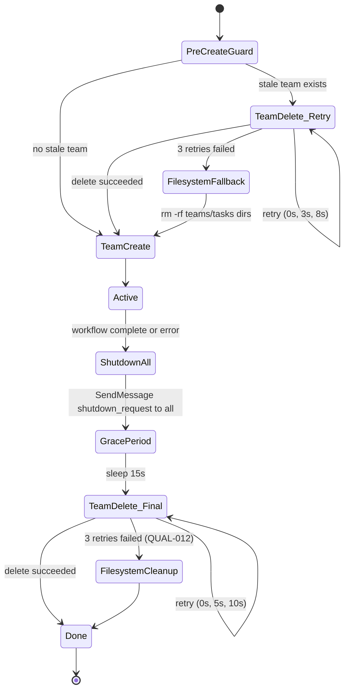
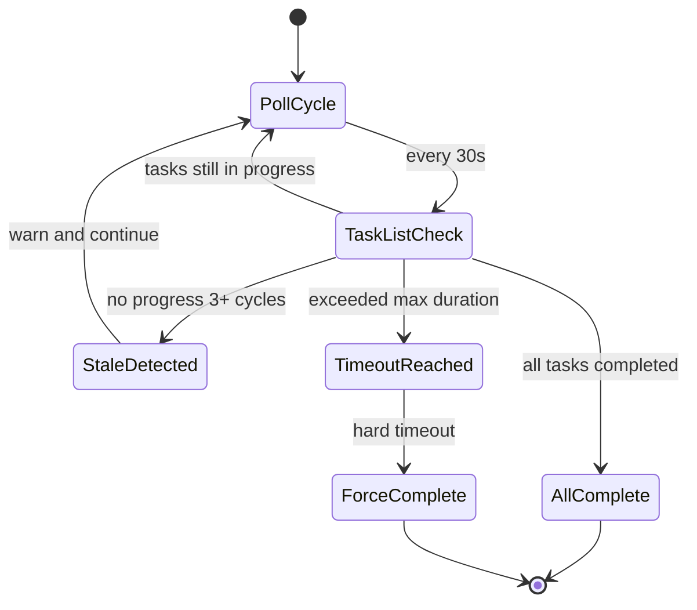
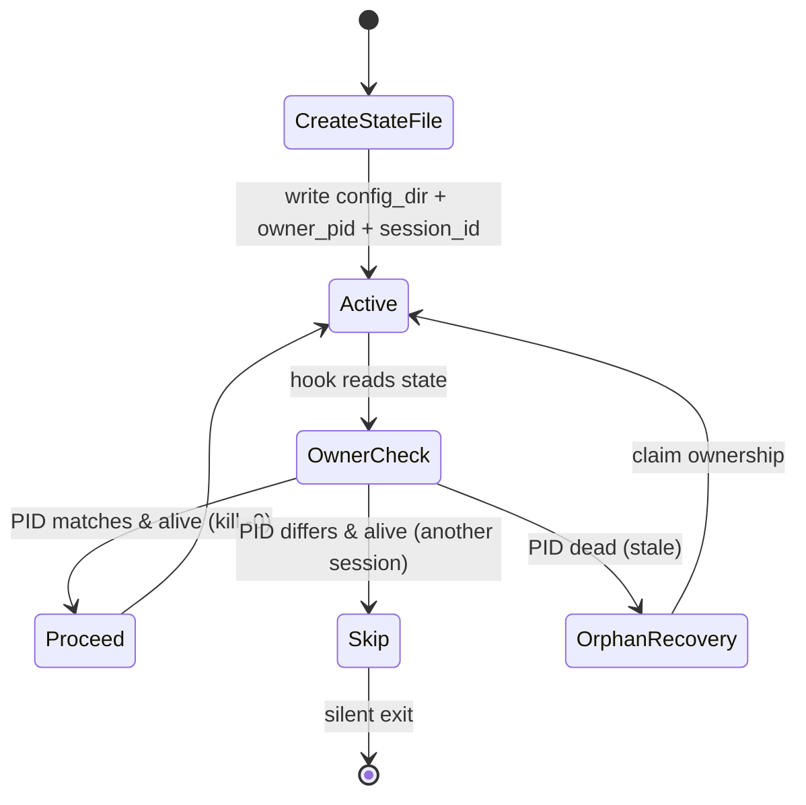

# LCM Summary sum_504de242a5ada787

Created: 2026-03-19 02:14:43
Kind: leaf
Depth: 0
Conversation: 4
Tokens: 1215
Descendants: 0
Earliest: 2026-03-18T16:32:38.000Z
Latest: 2026-03-18T16:32:38.000Z

## Content

[2026-03-18 16:32 UTC]
# Rune Plugin — State Machine Reference

> *"State machines are underrated for debugging because they force you to explicitly name
> every possible condition your code can be in. Most bugs happen in the unnamed states
> between the ones you thought about when writing the logic."*

This document maps every major Rune workflow as an explicit state machine — phases,
transitions, conditional gates, error paths, and artifacts. Use it to:

- **Verify correctness**: spot dead-end states, unreachable phases, orphaned artifacts
- **Debug failures**: trace exactly where a pipeline stopped and why
- **Understand recovery**: know which phases support resume/checkpoint
- **Onboard**: see the full picture before diving into SKILL.md prose

---

## Table of Contents

1. [Common Patterns](#common-patterns)
2. [Arc Pipeline](#1-arc-pipeline) (26 phases)
3. [Devise Pipeline](#2-devise-pipeline) (6 phases + sub-phases)
4. [Roundtable Circle](#3-roundtable-circle) (7 phases, shared orchestration)
5. [Appraise](#4-appraise) (code review)
6. [Audit](#5-audit) (full codebase)
7. [Strive](#6-strive) (swarm execution)
8. [Mend](#7-mend) (finding resolution)
9. [Forge](#8-forge) (plan enrichment)
10. [Goldmask](#9-goldmask) (impact analysis)
11. [Inspect](#10-inspect) (plan-vs-implementation)
12. [Cross-Workflow Dependencies](#cross-workflow-dependencies)
13. [Error Handling Tiers](#error-handling-tiers)

---

## Common Patterns

Every Rune workflow shares these foundational state machine patterns:

### Team Lifecycle (ATE-1)



### Monitoring Loop (POLL-001)



### State File (Session Isolation)



---

## 1. Arc Pipeline

**Command**: `/rune:arc plans/...`
**Duration**: 30–90 min | **Phases**: 26+ | **Resume**: Full checkpoint support

The arc pipeline is Rune's most complex state machine — a linear pipeline with
conditional branches, embedded sub-workflows (strive, appraise, mend, goldmask),
and 3-layer checkpoint/resume support.

```mermaid
stateDiagram-v2
    [*] --> Preflight

    state "Pre-flight" as Preflight {
        [*] --> GitStateCheck
        GitStateCheck --> FreshnessValidation
        FreshnessValidation --> StaleTeamCleanup
        StaleTeamCleanup --> [*]
    }

    Preflight --> Phase1_Forge : plan file valid

    state "Phase 1: Forge" as Phase1_Forge
    Phase1_Forge --> Phase2_PlanReview : enriched plan

    state "Phase 2: Plan Review" as Phase2_PlanReview {
        [*] --> ScrollReview
        ScrollReview --> VerificationGate
        VerificationGate --> [*] : PASS / CONCERN
        VerificationGate --> BLOCK : BLOCK verdict
    }

    Phase2_PlanReview --> Phase3_PlanRefinement : review findings
    Phase3_PlanRefinement --> Phase4_Verification : refined plan

    state "Phase 4: Verification" as Phase4_Verification
    Phase4_Verification --> Phase4_5_TaskDecomp : verified

    state "Phase 4.5: Task Decomposition" as Phase4_5_TaskDecomp
    Phase4_5_TaskDecomp --> Phase5_SemanticVerify : tasks extracted

    state "Phase 5: Semanti
[LCM fallback summary; truncated for context management]
